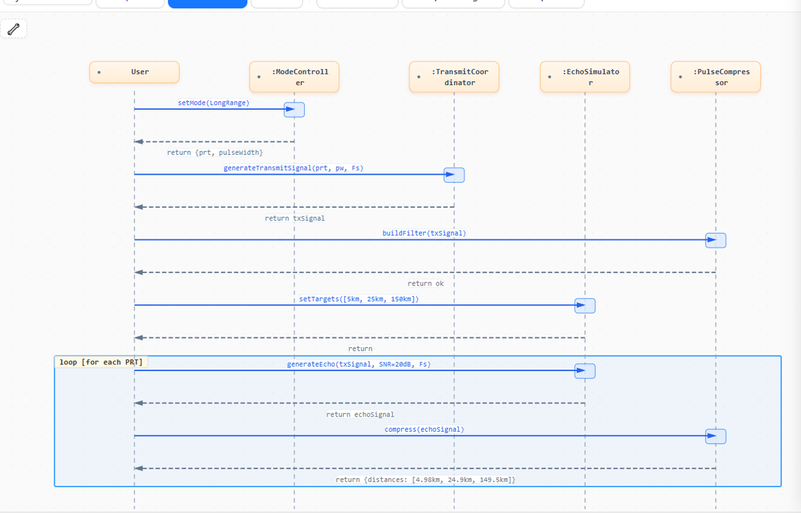
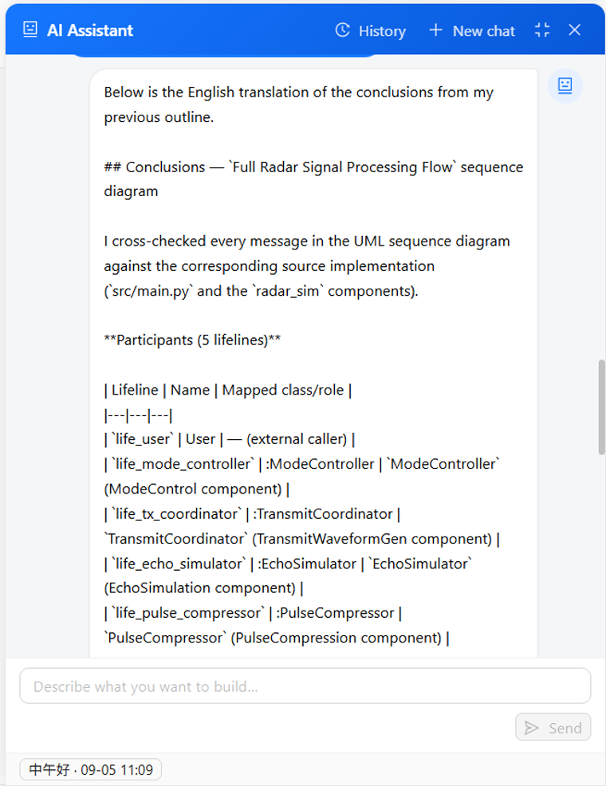
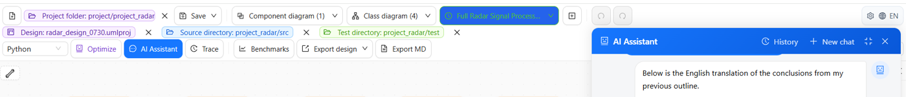

<div align="center">

# ArchitectCoder

**Turn Ideas into Architecture, Let Architecture Drive Development**

**English** | [中文](README_ZH.md)

[Quick start](#quick-start) · [Product tour](#product-tour) · [Quickstart case](examples/quickstart/)

</div>

ArchitectCoder is an AI-assisted development workbench with UML as its design entry point. It connects architecture design, code changes, testing, review, and replay into one traceable workflow. The current `dev-4.0` line includes the **DevAgent development assistant**, **Global UML Optimization**, **One-click DevAgent Capability Benchmark Center**, **TestHub Test Center**, **Trace Viewer & Replay**, **Knowledge Graph**, **Memory System**, and the **BaseAgents framework**.

## Product tour

<table>
<tr>
<td width="64%" valign="top">

<video controls muted loop playsinline poster="docs/media/workspace-canvas.png" width="100%">
  <source src="docs/media/architectcoder-demo.mp4" type="video/mp4">
  Your browser does not support embedded video. [Open the product demo](docs/media/architectcoder-demo.mp4).
</video>

<p align="center"><sub>Real browser recording: UML switching → Trace and Evaluation Center → DevAgent read-only project summary.</sub></p>
</td>
<td width="36%" valign="top">

### One traceable loop

1. **Model** the system with class, sequence, or component diagrams.
2. **Ask** DevAgent to inspect the design and workspace.
3. **Review** the proposed UML and scoped changes.
4. **Implement and verify** code, tests, traces, and results in one place.

The result is an engineering workflow that is easy to understand, review, and replay.
</td>
</tr>
</table>

### Evaluation Center demo

<video controls muted loop playsinline poster="docs/media/workspace-canvas.png" width="100%">
  <source src="docs/media/architectcoder-evaluation-demo.mp4" type="video/mp4">
  Your browser does not support embedded video. [Open the Evaluation Center demo](docs/media/architectcoder-evaluation-demo.mp4).
</video>

<p align="center"><sub>Real browser recording: performance results → three-version trend comparison → case-level Trace replay → archive center.</sub></p>

### See the workflow up close

<table>
<tr>
<td width="48%"></td>
<td width="26%"></td>
<td width="26%"></td>
</tr>
<tr>
<td align="center"><sub>Design in UML: sequence, class, and component diagrams</sub></td>
<td align="center"><sub>Collaborate with DevAgent in context</sub></td>
<td align="center"><sub>Move from design to trace, benchmark, and export</sub></td>
</tr>
</table>

> The screenshots and videos are intentionally kept under `docs/media/`, so maintainers can replace them with updated product captures without changing the README layout.

## Why ArchitectCoder?

- **Design as a source of truth**: Class, sequence, and component diagrams stay at the center of the development workflow.
- **Controlled AI development**: The Agent reads the smallest useful context, makes scoped changes, verifies them, and pauses for human review where required.
- **Traceable execution**: Tool calls, reviews, checkpoints, tests, and final results can be inspected and replayed.

## Core Capabilities

### Multi-Diagram Editor

| Diagram Type | Core Elements | Interaction |
|-------------|--------------|-------------|
| **Class Diagram** | Classes + 6 relationship types | Double-click to add / drag ports for relationships |
| **Sequence Diagram** | Lifelines + 5 message types | Double-click to add lifeline / click A→B for messages |
| **Component Diagram** | Components + dependencies + sub-components | Double-click to add / double-click inside for sub-components |

- Undo/Redo (50 steps), Zoom (toolbar + Ctrl+Scroll), Grid snapping
- Ctrl+C/V copy-paste, Ctrl+S save
- Property panel, configurable grid, and Space+Drag to pan
- Orthogonal edge segments can be adjusted directly; Alt+click cycles through overlapping edges
- Light, dark, blueprint, and eye-care canvas themes
- Export the current diagram as PNG/SVG, the complete project as `.umlproj`, or a diagram as Markdown

### Project Management

- `.umlproj` project file: one project, multiple diagrams of different types
- **Component-Diagram hierarchy**: `Project → Component → Class/Sequence Diagram` three-tier organization. Right-click a component to create/switch linked diagrams
- Toolbar groups diagrams by type with color-coded dropdowns (orange/blue/green)
- Legacy `.uml` files auto-wrapped into projects
- Project, source, and test directories can be selected separately for Agent work
- Workspace and safe-path policies keep Agent file access within configured roots
- **Quickstart case**: open [`examples/quickstart`](examples/quickstart/) for a complete Radar Signal Processing UML + Python + pytest project and a sanitized performance reference.

### AI Development Assistant

The bottom-right robot button opens the floating chat panel. The production **DevAgent** is a native-function-calling `ReActAgent` assembled through one shared runtime for interactive chat and evaluation. It handles both casual conversation and end-to-end engineering tasks:

- **Foundation tools**: `list_files`, `read_file`, `search_text`, `apply_changes`, `run_task`, `run_program`, and `shell`. All file creation, editing, deletion, moving, and copying goes through `apply_changes`; standard checks use `run_task` before lower-level command execution.
- **Design-first workflow**: design-impacting requests follow `inspect → update UML → validate and submit review → implement → verify`. Implementation-only requests can proceed directly. Business-code changes wait for accepted UML review when the request changes architecture.
- **Human review and safety**: `submit_uml_review` presents UML diffs for approval. Sensitive shell commands require approval, while high-risk operations are denied by policy.
- **Planning and delegation**: `todo_write` tracks multi-phase work with explicit verification. Optional orchestration can prepare a bounded plan and delegate read-only strategy exploration; the main Agent remains responsible for changes and verification. `spawn_subagent` is separately controlled and single-use per task.
- **Streaming and interruption**: tool calls, arguments, observations, thoughts, and todo progress stream to the UI. Users can stop a run; the execution checkpoint records completed, pending, changed, and verified items and can be resumed explicitly.
- **Context and evidence**: context budgets, history compaction, structured tool evidence, convergence guards, and final summaries keep long tasks recoverable and auditable.
- **Sessions and memory**: create or switch sessions, restore history after refresh, archive completed work to memory, and recall relevant project history in later tasks. SQLite/BM25 memory can be disabled or replaced through the provider boundary.
- **UML skill pack**: the Agent can load the UML 2.5.1 class, sequence, component, and cross-diagram guides on demand, including a small loadable `.umlproj` reference case.

All engineering capabilities use the same workspace tools, review gates, trace recording, and verification lifecycle, so chat, design changes, implementation, and evaluation remain consistent.

For the implementation boundaries behind this section, see the [current architecture](docs/current-architecture.md), [BaseAgents framework](docs/baseagents-design.md), [context management](docs/context-management-design.md), [convergence and budget rules](docs/agent-convergence-and-budget.md), and [runtime command contract](docs/runtime-command-execution.md).

### DevAgent Capability Benchmark Center

The Capability Benchmark Center is the quality gate for the production **DevAgent**. It turns engineering tasks into repeatable, versioned, evidence-backed evaluations instead of subjective demos.

#### What makes it a core capability

- **Production-path fidelity**: the benchmark exercises the same DevAgent runtime, workspace tools, safety policies, context handling, and verification flow used by the product.
- **Task-oriented coverage**: versioned cases cover project understanding, single-turn engineering work, multi-turn continuity, and design/code/test workflows.
- **Deterministic ground truth**: each case is bound to a controlled project fixture and manifest, then checked with hard gates and diagnostic checkers for files, UML, tests, protected paths, and other deliverables.
- **Safe and reproducible execution**: every run uses an isolated workspace with explicit time, tool-call, and token budgets. The current Git branch and commit are recorded as the evaluation version, and dirty workspaces are visible.
- **Explainable evidence**: every result includes pass/fail state, score, checker details, tool usage, token usage, duration, and a link to the complete Agent Trace.
- **Regression and release comparison**: the Evaluation Center supports one-click runs, historical batches, baseline snapshots, performance JSONL results, archives, and selected-version comparison.

#### Evaluation flow

~~~text
Versioned case
    → project fixture + manifest
    → production DevAgent
    → hard gates + diagnostic checkers
    → Trace + structured JSONL result
    → batch summary
    → multi-version comparison and archive
~~~

#### Evaluation Center

The UI turns the full workflow into an operational loop:

1. Select one or more suites or cases and start a run with one click.
2. Inspect case-level results, checker evidence, failures, timeouts, tool calls, and Trace sessions.
3. Review pass rate, score, average duration, token usage, and tool-call usage.
4. Compare selected builds from left to right by build time, including directional change indicators and signed percentages.
5. Archive a complete, auditable snapshot for release or regression tracking.

The CLI is also available for automation and CI-style checks:

~~~bash
python -m extensions.evals.cli --suite understanding
python -m extensions.evals.cli --suite single
python -m extensions.evals.cli --suite multiturn
~~~

See the [evaluation system design](docs/evaluation-system.md) for the case model, checker contract, isolation rules, result lifecycle, and API surface. The [Trace Case Factory](docs/trace-to-eval-case-factory-design.md) documents conversion of real traces into reviewable, validated evaluation-case drafts.

### Global UML Optimization

The toolbar's **Optimize / 全局优化** action now submits a natural-language request to the same DevAgent chat runtime. It saves the current project first when necessary, opens the assistant, and passes the project/source/test paths as context. The Agent then inspects and updates the relevant `.umlproj` artifacts through its normal tools, review gates, trace recording, and verification flow.

Global optimization follows the same safety, checkpoint, memory, trace, and audit behavior as every other Agent task.

### TestHub Test Center

Excel test-case-driven test code generation:

- **Case management**: load Excel test case sheets from the testHub directory, edit inline, and save back
- **Test code generation**: full or incremental (changed cases only) modes; generated test code is viewable, copyable, and downloadable in the "Test Code" tab
- **Review audit trail**: view / edit / generate / accept / reject operations are uniformly logged to `dev_review.txt`

### Trace Viewer & Replay

- **Full recording**: every Agent session is persisted as a JSONL trace (LLM requests/responses + step-by-step tool call events)
- **TraceViewer**: a drawer-style UI for browsing historical sessions, expanding each tool call's arguments and results
- **Long prompt inspection**: oversized LLM prompts and tool schemas stay compact by default and can be expanded to inspect the complete content in a scrollable panel
- **Deterministic replay**: `mock` mode replays from the recording with zero network access; `rerun` mode re-runs the real LLM while tools stay mocked; `live` mode runs the real LLM with real tools according to policy (`readonly` by default, `full` explicitly side-effecting)
- Replay supports whole-session execution, cumulative per-turn replay, match status, and original-vs-replay step comparison

See the [Trace replay design](docs/trace-replay-design.md) for event format, replay modes, workspace reconstruction, and API behavior.

### Knowledge Graph

SQLite graph database + FTS5 full-text index, rebuilt on project save when the
knowledge-graph plugin is enabled, giving the AI assistant structured project understanding:

- **Three knowledge layers**: Project → Entity → Relationship (inheritance/composition/dependency + design-code mapping + test coverage)
- **Dual-source build**: design layer (UML JSON auto-sync) + code layer (AST parsing of source directories)
- **Agent queries**: project maps, node search, and neighbor expansion complement file-level reading and search

See the [knowledge graph design](docs/knowledge-graph-design.md) for indexing, provider injection, tool boundaries, and design/code comparison.

### Memory System

The Agent recalls and archives project-scoped insights through a provider boundary. The bundled implementation uses SQLite + FTS5/BM25 with subject-based updates, recency scoring, decay, write gates, and maintenance; it can be disabled or replaced independently.

See the [memory system design](docs/memory-system-design.md) for storage, retrieval, lifecycle, and integration rules.

### Auto-Layout Engine

LLM-generated element positions auto-computed; manually positioned elements fully preserved:
- Class Diagram: inheritance layering + grid layout
- Sequence Diagram: lifelines evenly spaced + messages ordered vertically
- Component Diagram: flow layout with auto-wrap

## Capability documentation map

| Capability | Related documentation | Scope |
|---|---|---|
| Diagram editor and project management | [Current architecture](docs/current-architecture.md) | Frontend boundaries and workspace path policy; detailed interaction remains in-product |
| Agent composition, tools, lifecycle | [Current architecture](docs/current-architecture.md), [BaseAgents](docs/baseagents-design.md) | Production boundaries and framework APIs |
| Context, memory, convergence | [Context management](docs/context-management-design.md), [Memory system](docs/memory-system-design.md), [Convergence and budget](docs/agent-convergence-and-budget.md) | Runtime limits and long-task recovery |
| Command execution and workspace safety | [Runtime command contract](docs/runtime-command-execution.md) | OS adapters, filesystem and command policy |
| Global UML optimization | [Current architecture](docs/current-architecture.md) | Shared DevAgent chat path, review, checkpoint and trace behavior |
| Trace recording and replay | [Trace replay design](docs/trace-replay-design.md) | JSONL events, replay and API |
| Knowledge graph | [Knowledge graph design](docs/knowledge-graph-design.md) | Indexing, retrieval and provider boundary |
| Evaluation and Trace Case Factory | [Evaluation system](docs/evaluation-system.md), [Trace Case Factory](docs/trace-to-eval-case-factory-design.md) | Cases, fixtures, checkers, batches and publishing |
| Plugin loading and replacement | [Plugin architecture](docs/plugin-architecture-design.md) | Provider lifecycle, routing and fallback |
| TestHub and diagram editing | — | No standalone design document; use the API docs and in-product help for current UI contracts |

## Tech Stack

| Layer | Technology |
|-------|-----------|
| Frontend | React 18 + TypeScript + AntV X6 + Zustand + Ant Design 5 |
| Backend | FastAPI (Python) + WebSocket |
| Agent | BaseAgents (ReActAgent, native function calling) |
| LLM | OpenAI-compatible API (one fixed model per session, configured by `LLM_BASE_URL` and `LLM_MODEL_ID`) |
| Knowledge Graph | SQLite + FTS5 |
| Memory System | SQLite + FTS5 + jieba |
| Testing | pytest (real subprocess execution) + openpyxl (Excel cases) |
| Build | Vite |

## Project Structure

```
ArchitectCoder/
├── frontend/                       # React frontend
│   ├── src/
│   │   ├── components/
│   │   │   ├── Canvas/             # Three diagram editors (Class/Sequence/Component)
│   │   │   ├── AgentChat/          # AI Assistant floating panel (WebSocket)
│   │   │   ├── PropertyPanel/      # Property editing panel
│   │   │   ├── Toolbar/            # Toolbar
│   │   │   ├── CodeViewer/         # Code viewer (Monaco)
│   │   │   ├── DiffViewer/         # UML diff comparison view
│   │   │   ├── TestCaseViewer/     # TestHub Excel case management
│   │   │   ├── TestCodeViewer/     # Generated test code viewer
│   │   │   └── TraceViewer/        # Session trace visualization + replay
│   │   ├── stores/                 # Zustand state management
│   │   ├── services/               # API service layer (incl. agentChat WebSocket)
│   │   ├── types/                  # TypeScript type definitions
│   │   └── App.tsx
│   ├── package.json
│   └── vite.config.ts
├── backend/                        # FastAPI backend
│   ├── config/                      # Settings and AgentConfig
│   ├── app/
│   │   ├── api/                    # REST + WebSocket routes (files/llm/testhub/trace/metrics/evals)
│   │   ├── core/                   # Authentication / security
│   │   ├── models/                 # Pydantic data models
│   │   ├── services/               # sessions, execution, reviews, change sets, trace replay
│   │   ├── agent_base/             # BaseAgents framework (core/agents/tools)
│   │   │   └── tools/my_tools/     # File system primitives / todo / sub-agent / review
│   │   └── main.py
│   ├── evals/                      # Versioned evaluation cases and fixtures
│   ├── tests/                      # Unit and integration tests
│   ├── requirements.txt
│   └── .env
├── docs/                           # Design docs, evaluation baseline, and system archives
├── extensions/                     # Unified provider implementations and entry points
│   ├── orchestration/              # Orchestration providers
│   ├── memory/                     # Memory providers
│   ├── trace/                      # Trace providers
│   ├── evals/                      # Evaluation providers and CLI
│   └── knowledge_graph/            # Knowledge graph providers
├── skills/                           # UML design and trace-analysis skill packs
├── project/                        # Project code output (src/ + test/)
├── temp/                           # Runtime temp files (not committed)
├── .claude/                        # Claude Code configuration
├── README.md                       # English project documentation (default)
└── README_ZH.md                    # Chinese project documentation
```

## Extension layout

All plugin implementation code is physically kept under `extensions/`:
`orchestration/`, `memory/`, `trace/`, `evals/`, and `knowledge_graph/`.
The main flow loads implementations through the central plugin manager, while
stable ports and generic runtime infrastructure remain under `backend/app/`.
Application and Agent configuration are centralized under `backend/config/`.

Each extension exposes a `module:factory` entry point, for example
`extensions.memory:create`. Plugins can be enabled, disabled, or replaced by
setting the corresponding `AGENT_*_ENABLED` and `AGENT_*_PROVIDER` variables in
`backend/.env`. See [Plugin Architecture and Extension Contract](docs/plugin-architecture-design.md)
for the complete design, lifecycle, fallback behavior, and ownership rules.

Knowledge-graph tools use the same `AGENT_KNOWLEDGE_GRAPH_ENABLED` switch as
the graph provider. When enabled, the main Agent receives the default
`get_project_map`, `find_nodes`, and `expand_neighbors` tools; when disabled,
no knowledge-graph tools are registered.

## Quick Start

```bash
# From the repository root
python -m pip install -r backend/requirements.txt
# Create backend/.env from the provider-neutral template, then set:
# LLM_API_KEY, LLM_BASE_URL, and LLM_MODEL_ID
copy backend\.env.example backend\.env       # Windows (use cp on Unix)

# Backend
cd backend
python -X utf8 -m app.main          # http://localhost:8001

# Frontend
cd frontend
npm install
npm run dev                           # http://localhost:3000
```

### Try the bundled quickstart

1. Open the project directory `examples/quickstart` in the ArchitectCoder UI. Select the directory root, not only its `design` subdirectory; the UI will discover `design/radar_design.umlproj`, `src/`, and `test/` as the Agent workspace.
2. Open the floating **AI Assistant** and ask DevAgent to inspect or modify the Radar Signal Processing example. The bundled case is intentionally small and includes UML, Python source, pytest tests, and a design/source consistency check.
3. Run the example tests from the case directory:

   ```bash
   cd examples/quickstart
   python -m pytest test -q
   ```

4. The file `reference/performance-baseline.json` is a sanitized reference summary. It is not automatically registered as a live Performance Center result. To populate the Performance Center, run an evaluation batch and convert the completed batch to a performance result.

If the quickstart is copied outside the repository, add its parent directory to `WORKSPACE_ROOTS` in `backend/.env` and restart the backend. Paths selected inside the checked-out repository are trusted automatically. On startup, the frontend checks persisted project, source, test, and design paths and removes only stale entries; it does not clear all browser site data.

Optional settings include the `AGENT_*_ENABLED` switches and the `AGENT_*_PROVIDER` settings. The model is configured through the provider-neutral `LLM_API_KEY`, `LLM_BASE_URL`, and `LLM_MODEL_ID` variables. Configuration definitions are centralized in `backend/config/settings.py` and `backend/config/agent_config.py`; provider entry points are managed through `backend/app/agent_base/core/plugins.py` and implemented under `extensions/`. Set a plugin enabled flag to `false`, or set its provider to `none`, `noop`, or `disabled`, to turn it off. `WORKSPACE_ROOTS` controls additional Agent workspace roots, and `AGENT_COMMAND_ENVIRONMENT` is native/auto by default; use `wsl` explicitly when needed. `SUB_AGENT_MODEL` is accepted only as a deprecated compatibility setting and is ignored. If `INTERNAL_API_TOKEN` is set, configure the same value as `VITE_API_TOKEN` in `frontend/.env.local`. After dependencies are installed, Windows users can run `start.bat`; set `UVICORN_RELOAD=1` only when the development reloader is needed.

## API and Development Checks

- Backend REST APIs use the `/api` prefix and cover file operations, LLM access, TestHub, Trace, Agent metrics, and DevAgent evaluations. Global optimization is submitted through the Agent chat path.
- The conversational Agent uses WebSocket: `/api/agent/ws/chat`.
- API docs: open `http://localhost:8001/api/docs` after starting the backend.
- Unit tests: `cd backend && python -m pytest -q`.
- Run the full 18-case DevAgent catalog, including retained Trace regressions: `python -m extensions.evals.cli`. Run the formal 16-case baseline with the three suite commands above.
- Production frontend build: `cd frontend && npm run build`.

Evaluation and runtime logs are written to `temp/`. Generated code and databases are runtime artifacts and are not committed.

## Keyboard Shortcuts

| Shortcut | Action |
|----------|--------|
| Ctrl+Z / Ctrl+Y | Undo / Redo |
| Ctrl+C / Ctrl+V | Copy / Paste |
| Ctrl+S | Save project |
| Delete | Delete selected |
| Ctrl+Scroll | Zoom |
| Space+Drag | Pan |

## Supported Programming Languages

Python, Java, TypeScript, JavaScript, C#, C++, Go, Rust, Ruby, Swift, Kotlin, PHP
