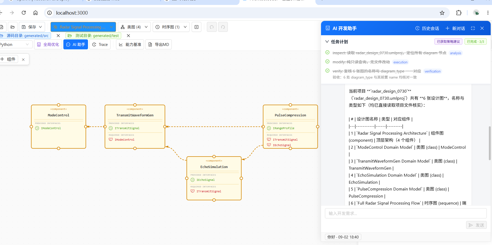

<div align="center">

# ArchitectCoder

**Turn Ideas into Architecture, Let Architecture Drive Development**

**English** | [中文](README_ZH.md)

</div>

ArchitectCoder is an AI-assisted development workbench with UML as its design entry point. It connects architecture design, code changes, testing, review, and replay into one traceable workflow. The current `dev-4.0` line includes the **DevAgent development assistant**, **Global UML Optimization**, **Capability Benchmark Center**, **TestHub Test Center**, **Trace Viewer & Replay**, **Knowledge Graph**, **Memory System**, and the **BaseAgents framework**.



## Why ArchitectCoder?

- **Design as a source of truth**: Class, sequence, and component diagrams stay at the center of the development workflow.
- **Controlled AI development**: The Agent reads the smallest useful context, makes scoped changes, verifies them, and pauses for human review where required.
- **Traceable execution**: Tool calls, reviews, checkpoints, tests, and final results can be inspected and replayed.

## Core Capabilities

### Multi-Diagram Editor

| Diagram Type | Core Elements | Interaction |
|-------------|--------------|-------------|
| **Class Diagram** | Classes + 6 relationship types | Double-click to add / drag ports for relationships |
| **Sequence Diagram** | Lifelines + 5 message types | Double-click to add lifeline / click A→B for messages |
| **Component Diagram** | Components + dependencies + sub-components | Double-click to add / double-click inside for sub-components |

- Undo/Redo (50 steps), Zoom (toolbar + Ctrl+Scroll), Grid snapping
- Ctrl+C/V copy-paste, Ctrl+S save
- Property panel, configurable grid, and Space+Drag to pan
- Orthogonal edge segments can be adjusted directly; Alt+click cycles through overlapping edges
- Light, dark, blueprint, and eye-care canvas themes
- Export the current diagram as PNG/SVG, the complete project as `.umlproj`, or a diagram as Markdown

### Project Management

- `.umlproj` project file: one project, multiple diagrams of different types
- **Component-Diagram hierarchy**: `Project → Component → Class/Sequence Diagram` three-tier organization. Right-click a component to create/switch linked diagrams
- Toolbar groups diagrams by type with color-coded dropdowns (orange/blue/green)
- Legacy `.uml` files auto-wrapped into projects
- Project, source, and test directories can be selected separately for Agent work
- Workspace and safe-path policies keep Agent file access within configured roots

### AI Development Assistant

The bottom-right robot button opens the floating chat panel. The production **DevAgent** is a native-function-calling `ReActAgent` assembled through one shared runtime for interactive chat and evaluation. It handles both casual conversation and end-to-end engineering tasks:

- **Foundation tools**: `list_files`, `read_file`, `search_text`, `apply_changes`, `run_task`, `run_program`, and `shell`. All file creation, editing, deletion, moving, and copying goes through `apply_changes`; standard checks use `run_task` before lower-level command execution.
- **Design-first workflow**: design-impacting requests follow `inspect → update UML → validate and submit review → implement → verify`. Implementation-only requests can proceed directly. Business-code changes wait for accepted UML review when the request changes architecture.
- **Human review and safety**: `submit_uml_review` presents UML diffs for approval. Sensitive shell commands require approval, while high-risk operations are denied by policy.
- **Planning and delegation**: `todo_write` tracks multi-phase work with explicit verification. Optional orchestration can prepare a bounded plan and delegate read-only strategy exploration; the main Agent remains responsible for changes and verification. `spawn_subagent` is separately controlled and single-use per task.
- **Streaming and interruption**: tool calls, arguments, observations, thoughts, and todo progress stream to the UI. Users can stop a run; the execution checkpoint records completed, pending, changed, and verified items and can be resumed explicitly.
- **Context and evidence**: context budgets, history compaction, structured tool evidence, convergence guards, and final summaries keep long tasks recoverable and auditable.
- **Sessions and memory**: create or switch sessions, restore history after refresh, archive completed work to memory, and recall relevant project history in later tasks. SQLite/BM25 memory can be disabled or replaced through the provider boundary.
- **UML skill pack**: the Agent can load the UML 2.5.1 class, sequence, component, and cross-diagram guides on demand, including a small loadable `.umlproj` reference case.

The production Agent no longer depends on separate code-generation, code-fixer, or standalone UML-optimizer tool chains. It uses the shared workspace tools and the normal review/verification lifecycle.

### DevAgent Capability Benchmark

The evaluation system now covers only the production **DevAgent** path. Legacy / standalone ReAct evaluation routes are no longer maintained, preventing different Agent paths from contaminating DevAgent measurements. Each case is defined by controlled JSON, bound to a fixed project fixture and manifest, and executed in an isolated workspace:

- **Case catalog**: `backend/evals/cases/`, currently 18 cases: 4 `understanding`, 8 `single`, 4 `multiturn`, plus 2 retained `trace-3.1` regression cases. The formal baseline contains only the first 16 cases.
- **Baseline scope**: the 16-case baseline covers project understanding, single-turn read/create/update/delete tasks, and multi-turn conversations whose greeting turn must not call tools. The two `trace-3.1` cases remain available for regression history but are excluded from baseline scoring.
- **Execution flow**: `case → fixture/project manifest → DevAgent → hard checkers/checkers → Trace + JSONL result`.
- **Deterministic checks**: pytest, UML validity/structure/method/sequence checks, file existence/content checks, and protected-path integrity checks.
- **Runtime limits**: normal cases use the production DevAgent limits: 50 steps, 100 tool calls, 600 seconds, and 200,000 total tokens per single task. Multi-turn cases receive a fresh task budget per user turn; cumulative usage is report-only.
- **Tracked baseline snapshot**: `backend/evals/baseline.json` records `4.0@4076efc`: 8 of 16 cases passed, 5 failed, 0 timed out, and 3 errored; average score `0.7221`, with 2,918,570 total tokens and 418 tool calls.
- **Version identity**: the Evaluation Center automatically reads the current Git branch and HEAD commit and uses `branch@commit` as the version. An uncommitted working tree is marked `dirty`.
- **Run, merge, and archive**: the Evaluation Center guides users through `运行批次 → 性能结果 → 多版本对比 → 已归档`. Completed same-version batches can be merged into one performance JSONL result; exact duplicate results reuse an existing file. Batch and performance-result entries can be deleted after confirmation; baseline files and archived snapshots are not modified.
- **CLI**: run the three formal baseline suites separately, or run the retained Trace suite for regression:

  ```bash
  python -m extensions.evals.cli --suite understanding
  python -m extensions.evals.cli --suite single
  python -m extensions.evals.cli --suite multiturn
  python -m extensions.evals.cli --suite trace-3.1
  ```

  The CLI returns a non-zero exit code when any case fails or times out. This means the evaluation result is not all green; it does not mean that the evaluation framework failed to start.

### Global UML Optimization

The toolbar's **Optimize / 全局优化** action now submits a natural-language request to the same DevAgent chat runtime. It saves the current project first when necessary, opens the assistant, and passes the project/source/test paths as context. The Agent then inspects and updates the relevant `.umlproj` artifacts through its normal tools, review gates, trace recording, and verification flow.

There is no separate `/api/optimize_v2` pipeline in the current branch. Global optimization follows the same safety, checkpoint, memory, and audit behavior as every other Agent task.

### TestHub Test Center

Excel test-case-driven test code generation:

- **Case management**: load Excel test case sheets from the testHub directory, edit inline, and save back
- **Test code generation**: full or incremental (changed cases only) modes; generated test code is viewable, copyable, and downloadable in the "Test Code" tab
- **Review audit trail**: view / edit / generate / accept / reject operations are uniformly logged to `dev_review.txt`

### Trace Viewer & Replay

- **Full recording**: every Agent session is persisted as a JSONL trace (LLM requests/responses + step-by-step tool call events)
- **TraceViewer**: a drawer-style UI for browsing historical sessions, expanding each tool call's arguments and results
- **Long prompt inspection**: oversized LLM prompts and tool schemas stay compact by default and can be expanded to inspect the complete content in a scrollable panel
- **Deterministic replay**: `mock` mode replays from the recording with zero network access; `rerun` mode re-runs the real LLM while tools stay mocked; `live` mode runs the real LLM with real tools according to policy (`readonly` by default, `full` explicitly side-effecting)
- Replay supports whole-session execution, cumulative per-turn replay, match status, and original-vs-replay step comparison

### Knowledge Graph

SQLite graph database + FTS5 full-text index, rebuilt on project save when the
knowledge-graph plugin is enabled, giving the AI assistant structured project understanding:

- **Three knowledge layers**: Project → Entity → Relationship (inheritance/composition/dependency + design-code mapping + test coverage)
- **Dual-source build**: design layer (UML JSON auto-sync) + code layer (AST parsing of source directories)
- **Agent queries**: project maps, node search, and neighbor expansion complement file-level reading and search

### Auto-Layout Engine

LLM-generated element positions auto-computed; manually positioned elements fully preserved:
- Class Diagram: inheritance layering + grid layout
- Sequence Diagram: lifelines evenly spaced + messages ordered vertically
- Component Diagram: flow layout with auto-wrap

## Tech Stack

| Layer | Technology |
|-------|-----------|
| Frontend | React 18 + TypeScript + AntV X6 + Zustand + Ant Design 5 |
| Backend | FastAPI (Python) + WebSocket |
| Agent | BaseAgents (ReActAgent, native function calling) |
| LLM | DeepSeek API (one fixed model per session, configured by `DEEPSEEK_MODEL`) |
| Knowledge Graph | SQLite + FTS5 |
| Memory System | SQLite + FTS5 + jieba |
| Testing | pytest (real subprocess execution) + openpyxl (Excel cases) |
| Build | Vite |

## Project Structure

```
ArchitectCoder/
├── frontend/                       # React frontend
│   ├── src/
│   │   ├── components/
│   │   │   ├── Canvas/             # Three diagram editors (Class/Sequence/Component)
│   │   │   ├── AgentChat/          # AI Assistant floating panel (WebSocket)
│   │   │   ├── PropertyPanel/      # Property editing panel
│   │   │   ├── Toolbar/            # Toolbar
│   │   │   ├── CodeViewer/         # Code viewer (Monaco)
│   │   │   ├── DiffViewer/         # UML diff comparison view
│   │   │   ├── TestCaseViewer/     # TestHub Excel case management
│   │   │   ├── TestCodeViewer/     # Generated test code viewer
│   │   │   └── TraceViewer/        # Session trace visualization + replay
│   │   ├── stores/                 # Zustand state management
│   │   ├── services/               # API service layer (incl. agentChat WebSocket)
│   │   ├── types/                  # TypeScript type definitions
│   │   └── App.tsx
│   ├── package.json
│   └── vite.config.ts
├── backend/                        # FastAPI backend
│   ├── config/                      # Settings and AgentConfig
│   ├── app/
│   │   ├── api/                    # REST + WebSocket routes (files/llm/testhub/trace/metrics/evals)
│   │   ├── core/                   # Authentication / security
│   │   ├── models/                 # Pydantic data models
│   │   ├── services/               # sessions, execution, reviews, change sets, trace replay
│   │   ├── agent_base/             # BaseAgents framework (core/agents/tools)
│   │   │   └── tools/my_tools/     # File system primitives / todo / sub-agent / review
│   │   └── main.py
│   ├── evals/                      # Versioned evaluation cases and fixtures
│   ├── tests/                      # Unit and integration tests
│   ├── requirements.txt
│   └── .env
├── docs/                           # Design docs, evaluation baseline, and system archives
├── extensions/                     # Unified provider implementations and entry points
│   ├── orchestration/              # Orchestration providers
│   ├── memory/                     # Memory providers
│   ├── trace/                      # Trace providers
│   ├── evals/                      # Evaluation providers and CLI
│   └── knowledge_graph/            # Knowledge graph providers
├── skills/                           # UML design and trace-analysis skill packs
├── project/                        # Project code output (src/ + test/)
├── temp/                           # Runtime temp files (not committed)
├── .claude/                        # Claude Code configuration
├── README.md                       # English project documentation (default)
└── README_ZH.md                    # Chinese project documentation
```

## Extension layout

All plugin implementation code is physically kept under `extensions/`:
`orchestration/`, `memory/`, `trace/`, `evals/`, and `knowledge_graph/`.
The main flow loads implementations through the central plugin manager, while
stable ports and generic runtime infrastructure remain under `backend/app/`.
Application and Agent configuration are centralized under `backend/config/`.

Each extension exposes a `module:factory` entry point, for example
`extensions.memory:create`. Plugins can be enabled, disabled, or replaced by
setting the corresponding `AGENT_*_ENABLED` and `AGENT_*_PROVIDER` variables in
`backend/.env`. See [Plugin Architecture Design Archive](docs/plugin-architecture-design.md)
for the complete design, lifecycle, fallback behavior, and ownership rules.

Knowledge-graph tools use the same `AGENT_KNOWLEDGE_GRAPH_ENABLED` switch as
the graph provider. When enabled, the main Agent receives the default
`get_project_map`, `find_nodes`, and `expand_neighbors` tools; when disabled,
no knowledge-graph tools are registered.

## Quick Start

```bash
# Backend
cd backend
python -m pip install -r requirements.txt
# Create backend/.env and set at least: DEEPSEEK_API_KEY=your-key
python -X utf8 -m app.main          # http://localhost:8001

# Frontend
cd frontend
npm install
npm run dev                           # http://localhost:3000
```

Optional settings include `DEEPSEEK_MODEL` (one fixed model per session), the `AGENT_*_ENABLED` switches, and the `AGENT_*_PROVIDER` settings. Configuration definitions are centralized in `backend/config/settings.py` and `backend/config/agent_config.py`; provider entry points are managed through `backend/app/agent_base/core/plugins.py` and implemented under `extensions/`. Set a plugin enabled flag to `false`, or set its provider to `none`, `noop`, or `disabled`, to turn it off. `WORKSPACE_ROOTS` controls additional Agent workspace roots, and `AGENT_COMMAND_ENVIRONMENT` is native/auto by default; use `wsl` explicitly when needed. `SUB_AGENT_MODEL` is accepted only as a deprecated compatibility setting and is ignored. If `INTERNAL_API_TOKEN` is set, configure the same value as `VITE_API_TOKEN` in `frontend/.env.local`. After dependencies are installed, Windows users can run `start.bat`; set `UVICORN_RELOAD=1` only when the development reloader is needed.

## API and Development Checks

- Backend REST APIs use the `/api` prefix and cover file operations, LLM access, TestHub, Trace, Agent metrics, and DevAgent evaluations. Global optimization is submitted through the Agent chat path.
- The conversational Agent uses WebSocket: `/api/agent/ws/chat`.
- API docs: open `http://localhost:8001/api/docs` after starting the backend.
- Unit tests: `cd backend && python -m pytest -q`.
- Run the full 18-case DevAgent catalog, including retained Trace regressions: `python -m extensions.evals.cli`. Run the formal 16-case baseline with the three suite commands above.
- Production frontend build: `cd frontend && npm run build`.

Evaluation and runtime logs are written to `temp/`. Generated code and databases are runtime artifacts and are not committed.

## Keyboard Shortcuts

| Shortcut | Action |
|----------|--------|
| Ctrl+Z / Ctrl+Y | Undo / Redo |
| Ctrl+C / Ctrl+V | Copy / Paste |
| Ctrl+S | Save project |
| Delete | Delete selected |
| Ctrl+Scroll | Zoom |
| Space+Drag | Pan |

## Supported Programming Languages

Python, Java, TypeScript, JavaScript, C#, C++, Go, Rust, Ruby, Swift, Kotlin, PHP
