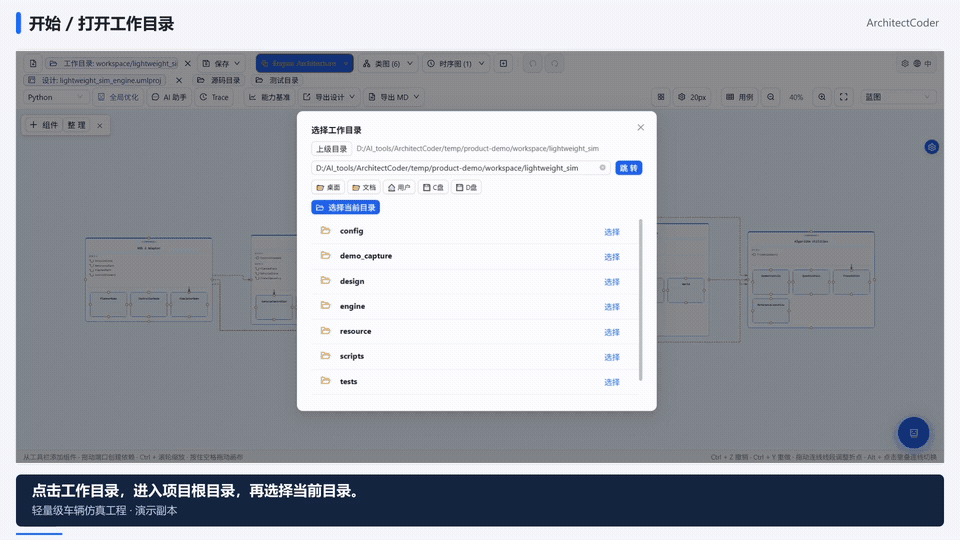
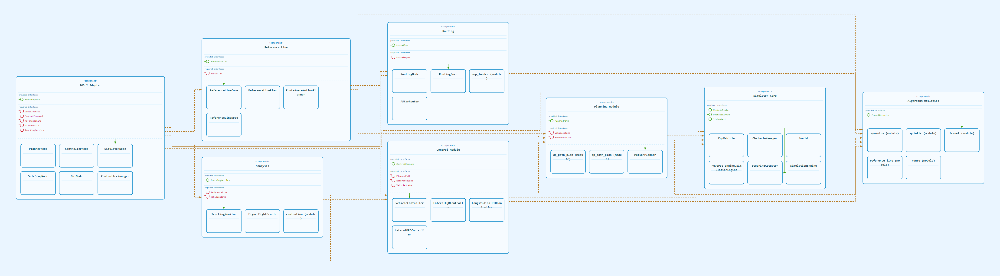
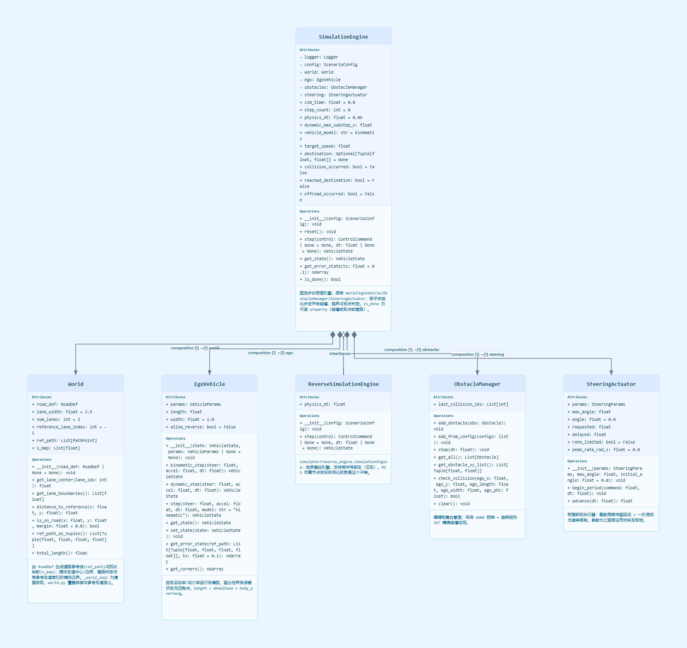
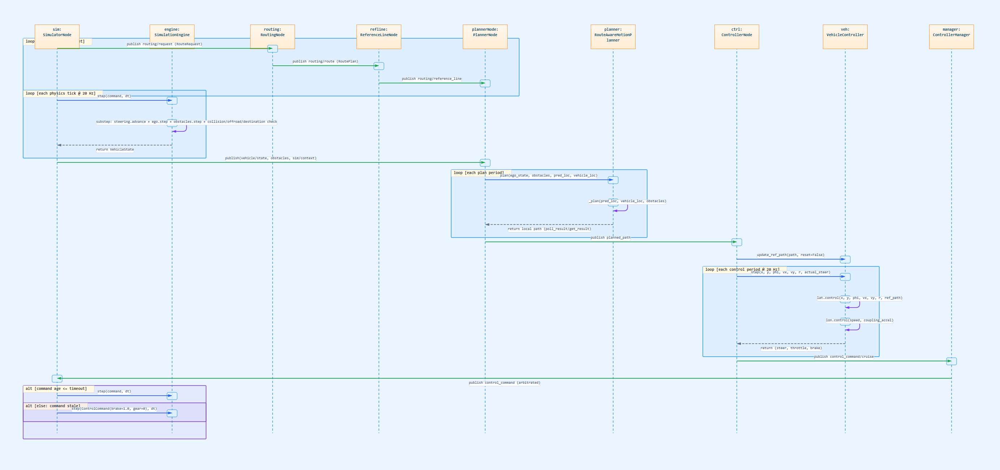
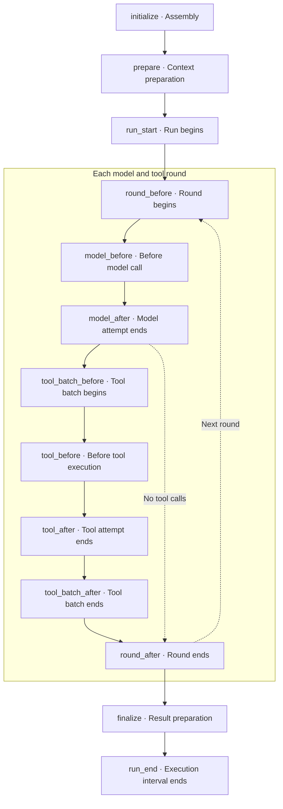
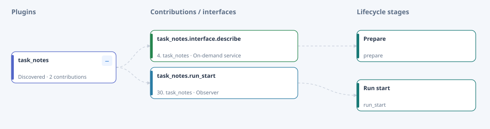
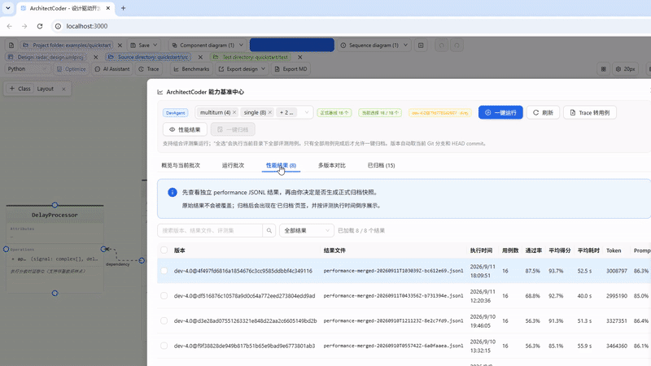

<div align="center">

# ArchitectCoder

**Turn Ideas into Architecture, Let Architecture Drive Development**

**English** | [中文](README_ZH.md)

[Quick start](#quick-start) · [Product tour](#product-tour) · [Core capabilities](#core-capabilities) · [Real project case](#real-project-case-lightweight-vehicle-simulation) · [Plugin architecture](#plugin-walkthrough) · [Documentation](#documentation)

</div>

ArchitectCoder is an **architecture-driven development workbench for AI coding agents**.

How do you preserve module boundaries, interface contracts, and design intent as AI agents keep changing code? As a project evolves, how do you detect and address drift between its design and source code?

ArchitectCoder brings explicit design, human review, and design contract checks into the development workflow: review design intent before changes, check design–implementation consistency before committing, and fill or update designs from existing source code. Drift identified within the checks' coverage can inform code repairs or reviewed design updates:

**Requirements → Design changes → Human review → Agent implementation → Tests & contract checks**

This path applies to architecture changes with design contracts enabled. Simple implementation changes can proceed directly, and existing source code can also be used to fill design gaps.

- **Design and code together**: develop UML from requirements or fill design gaps from existing source code.
- **Review and check changes**: review design proposals and check candidate implementations when contracts are enabled.
- **Trace and extend execution**: inspect execution through Trace and connect plugin capabilities through public lifecycle stages and slots.

## Product tour

<table>
<tr>
<td width="64%" valign="top">

<a href="https://raw.githubusercontent.com/Zhuweilong123/ArchitectCoder/dev-4.0/docs/media/architectcoder-demo.mp4"></a>

<p align="center"><sub>Animated browser preview. <a href="https://raw.githubusercontent.com/Zhuweilong123/ArchitectCoder/dev-4.0/docs/media/architectcoder-demo.mp4">Open the full MP4 demo</a>.</sub></p>

<p align="center"><sub>Edited real browser captures: open the workspace and load design/source → check and update UML → compare before/after designs and review → inspect Trace.</sub></p>
</td>
<td width="36%" valign="top">

### One traceable loop

1. **Model** the system with class, sequence, or component diagrams.
2. **Ask** DevAgent to inspect the design and workspace.
3. **Review** the proposed UML and scoped changes.
4. **Implement and verify** code, tests, traces, and results in one place.

The result is an engineering workflow that is easy to understand, review, and replay.
</td>
</tr>
</table>

## Core capabilities

### Architecture design and navigation

- **Three diagram types**: class diagrams for structure, component diagrams for module boundaries and interfaces, and sequence diagrams for interactions.
- **Linked designs**: associate class/sequence diagrams with components; create or switch linked diagrams from a component's context menu.
- **Relationship-driven layout**: arrange class and component diagrams by dependencies and containment, pack disconnected groups, and separate component dependency routes. Sequence diagrams space lifelines and messages along the timeline.
- **Canvas editing**: property panels, copy/paste, undo/redo, grid snapping, adjustable orthogonal edges, and four canvas themes.
- **Project workspace**: discover conventional `design/`, `src/`, and `test/` directories from the selected root, with separate directory overrides when needed. Reopen the last saved design after refresh.

### Reviewable AI development

**DevAgent** inspects the workspace, edits designs and files, executes checks, and reports results through a streaming conversation. The **Optimize** action sends a cross-diagram inspection/optimization request through the same Agent workflow.

Choose the design contract mode for the task:

- **Design contract on: design first, then develop.** For changes to architecture, interfaces, or interactions, update and review the UML before implementing and verifying code. A design contract check runs before changes are committed.
- **Design contract off: synchronize design from code.** Start from an existing codebase and ask DevAgent to analyze the implementation and add or update UML. The design contract gate is skipped for that run; synchronization starts when you request it.

- **Design review**: compare original and proposed designs, with semantic highlights for changed elements, members, and relationships. Accept changes or give feedback for revision.
- **Design contracts**: when enabled, collect design/source/test facts, check consistency, and feed failures into the execution and review lifecycle. The chat's contract switch controls the next run.
- **Execution progress**: follow task lists and tool steps, stop a run, and explicitly resume supported checkpoints.
- **Project history**: switch sessions, restore conversation history, and use project-scoped memory through configurable providers.
- **Controlled changes**: workspace boundaries, scoped file changes, conflict detection, command policy, and sensitive-command approval.

### Export and delivery

| Format | Use |
|---|---|
| **HTML** | Entire project in one offline, read-only file with a diagram directory, zoom, drag-to-pan, fit-to-window, and English/Chinese UI |
| **PNG / SVG** | Current diagram for presentations, documentation, and scalable graphics |
| **`.umlproj`** | Complete editable project to reopen in ArchitectCoder |
| **Markdown ZIP** | Current or full-project design documents packaged with SVG diagrams |

HTML embeds its images, styles, and scripts, with no external dependencies. It preserves the exported diagram view; use `.umlproj` to continue editing. See [HTML export](docs/project-html-export.md).

## Real project case: lightweight vehicle simulation

We used DevAgent on a vehicle simulation project with **93 Python files and about 12,000 lines of Python**. It compared the existing UML project with the source, identified missing design coverage, and updated the component and class diagrams. The design grew from **8 to 11 diagrams**, adding class diagrams for routing, reference lines, and analysis. The update passed UML structure validation and human review before it was committed to the simulation repository.

[Inspect the design commit](https://github.com/Zhuweilong123/my_carla_sim/commit/998a6c813683dd76234a85432b29a807d694c9e3)

**System architecture · Engine Architecture**

The component diagram shows the simulation core, planning, control, routing, reference line, analysis, and ROS 2 adapter modules, with their interfaces, dependencies, and child components.

[](docs/media/lightweight-sim/engine-architecture.png)

**Core structure · Simulator Core Classes**

The class diagram details how `SimulationEngine` composes `World`, `EgoVehicle`, `ObstacleManager`, and `SteeringActuator`, and how the reverse simulation engine inherits from it.

[](docs/media/lightweight-sim/simulator-core-classes.png)

**Runtime flow · Autonomous Driving Loop**

The sequence diagram connects routing and reference line generation, simulation state publication, path planning, vehicle control, and command feedback. It also shows the branch for stale control commands.

[](docs/media/lightweight-sim/autonomous-driving-loop.png)

Click an image for its full size, or open an SVG to zoom in: [component diagram](docs/media/lightweight-sim/engine-architecture.svg) · [class diagram](docs/media/lightweight-sim/simulator-core-classes.svg) · [sequence diagram](docs/media/lightweight-sim/autonomous-driving-loop.svg).

## Plugin walkthrough

Add checks, memory, or orchestration capabilities through plugins to keep the main workflow stable.

**A stage can host multiple slots, and a slot can accept capabilities from multiple plugins.**

Public lifecycle stages define when execution happens; slots define the contracts for connecting capabilities. The host dispatches plugins according to their declarations. New capabilities should use existing slots where possible, keeping changes within the plugin. For example, multiple checks can share `execution.check`; any rejection prevents candidate changes from being committed.

### 13 public lifecycle stages

Stages cover assembly, context preparation, model and tool rounds, and execution cleanup. The diagram shows their logical positions: rounds can repeat, responses without tool calls skip the tool batch, and tools within a batch may run concurrently according to execution policy.


```mermaid
flowchart TD
    init["initialize · Assembly"] --> prep["prepare · Context preparation"]
    prep --> start["run_start · Run begins"]
    start --> rb
    subgraph round["Each model and tool round"]
        rb["round_before · Round begins"] --> mb["model_before · Before model call"]
        mb --> ma["model_after · Model attempt ends"]
        ma --> bb["tool_batch_before · Tool batch begins"]
        bb --> tb["tool_before · Before tool execution"]
        tb --> ta["tool_after · Tool attempt ends"]
        ta --> ba["tool_batch_after · Tool batch ends"]
        ba --> ra["round_after · Round ends"]
        ma -. No tool calls .-> ra
    end
    ra -. Next round .-> rb
    ra --> fin["finalize · Result preparation"]
    fin --> endrun["run_end · Execution interval ends"]
```

This is a lifecycle overview: prepare can repeat, and errors or cancellation may enter cleanup early. model_after and tool_after also cover failed, cancelled, or blocked attempts. Slot services require explicit requests; ordinary stage broadcasts do not execute them automatically.

### Independent notifications

Notifications report specific events separately from the 13 public stages. They do not form a fixed sequence.

| Notification | Meaning |
|---|---|
| `error` | An error occurred |
| `cancel` | Execution was cancelled |
| `review_after` | A review result became available |
| `background_before` | Background work begins |
| `background_after` | Background work ends with a completion, failure, or other status |
| `task_after` | Publishes the task outcome after checking or review; it can include a waiting-for-review status |

`run_end` marks the end of an execution interval; review and background work may still be pending. See [plugin lifecycle](docs/plugin-lifecycle.md) (Chinese) for the full stage, notification, and contribution contracts.

### Connection example

Explore the framework without a video: **main flow → plugin details → interface search**, then verify `task_notes` locally and inspect its execution in a DevAgent task. Plugins declare their own interfaces and phase contributions and are discovered from configured directories.

[](docs/plugin-quickstart.en.md)

*Architecture preview generated from the real example declarations.*

[Follow the step-by-step guide](docs/plugin-quickstart.en.md) · [Download the offline HTML example](docs/media/plugin-demo/plugin-architecture-en.html)

On GitHub, download the **raw HTML file** and open it in a browser. No installation or model is needed for the offline viewer. Local plugin checks need backend dependencies; the application walkthrough needs a configured model and Trace enabled.

## Verification and advanced capabilities

- **DevAgent Capability Benchmark Center**: run versioned cases in isolated workspaces using the production Agent; inspect checker results, tool/token usage, duration, and linked traces. Compare builds and archive results.
- **Trace Viewer & Replay**: inspect recorded model/tool events and compare replayed steps. `mock` replay uses recorded data without model calls; `rerun` and `live` modes have different model/tool execution policies.
- **TestHub**: load, edit, and save Excel test cases in the canvas, with review records. Ask DevAgent to write or update test code through the workspace workflow.
- **Knowledge graph and memory**: configurable providers for design/code/test indexing and project-scoped recall.
- **Extensible runtime**: replace orchestration, memory, Trace, evaluation, knowledge graph, and design-contract implementations through plugin contracts. See the [plugin walkthrough](#plugin-walkthrough) for the stage and slot model.

### Evaluation Center demo

<a href="https://raw.githubusercontent.com/Zhuweilong123/ArchitectCoder/dev-4.0/docs/media/architectcoder-evaluation-demo.mp4"></a>

<p align="center"><sub>Animated browser preview. <a href="https://raw.githubusercontent.com/Zhuweilong123/ArchitectCoder/dev-4.0/docs/media/architectcoder-evaluation-demo.mp4">Open the full MP4 demo</a>.</sub></p>

<p align="center"><sub>Real browser recording: performance results → three-version trend comparison → case-level Trace replay → archive center.</sub></p>

## Language and toolchain support

The UI offers 12 target-language choices. **Task execution and source understanding have different support boundaries**:

- Project task resolution covers Python, Node.js, CMake/CTest, Cargo, Maven/Gradle, Go, .NET, and explicit `.architectcoder/tasks.json` tasks. Execution depends on available toolchains and the configured execution policy.
- Source-fact collection includes Python AST parsing and a C++ Clang adapter foundation with compilation-database support. Other language choices do not imply equivalent structural parsing or design-contract coverage.
- The bundled quickstart demonstrates a Python design/source/test workflow. See [multilanguage execution](docs/multilanguage-execution-design.md) for implementation scope and prerequisites.

## Documentation

| Topic | Guide |
|---|---|
| All documentation | [Documentation index](docs/README.md) |
| Agent architecture and framework | [Current architecture](docs/current-architecture.md) · [BaseAgents](docs/baseagents-design.md) |
| Design/source consistency | [Design contract](docs/design-source-contract.md) |
| Project HTML delivery | [HTML export](docs/project-html-export.md) |
| Task execution and language support | [Command execution](docs/runtime-command-execution.md) · [Multilanguage execution](docs/multilanguage-execution-design.md) |
| Evaluation and replay | [Evaluation system](docs/evaluation-system.md) · [Trace replay](docs/trace-replay-design.md) · [Trace Case Factory](docs/trace-to-eval-case-factory-design.md) |
| Context and project knowledge | [Context management](docs/context-management-design.md) · [Memory](docs/memory-system-design.md) · [Knowledge graph](docs/knowledge-graph-design.md) |
| Extension development | [Current architecture](docs/current-architecture.md) · [Plugin lifecycle](docs/plugin-lifecycle.md) |
| Plugin scaffolding and local checks | [Plugin development toolkit](docs/plugin-development.md) |
| Plugin walkthrough and offline example | [Step-by-step guide](docs/plugin-quickstart.en.md) · [HTML example](docs/media/plugin-demo/plugin-architecture-en.html) |
| Reusable Agent guides | [Skill plugin](docs/skills-plugin.md) |
| Plugin execution plans | [Lifecycle contributions and graphs](docs/plugin-lifecycle.md) |

## Development

**Stack:** React 18, TypeScript, AntV X6, Zustand, Ant Design 5, FastAPI, WebSocket, SQLite, and Vite.

```text
frontend/         UML editors, Agent chat, review, export, and evaluation UI
backend/app/      API, Agent core, execution lifecycle, and runtime ports
backend/config/   Application and Agent configuration
extensions/       Orchestration, memory, Trace, evaluation, KG, design contracts
examples/         Bundled projects
skills/           Loadable Agent guides
docs/             Usage, design, and implementation documentation
temp/             Runtime artifacts
```

- Backend checks: run `python -m pytest -q` from `backend/`.
- Frontend checks: run `npm run build`, `npm run test:layout`, and `npm run test:html` from `frontend/`.
- Agent evaluations: run `python -m extensions.evals.cli --suite understanding` from the repository root; `single` and `multiturn` suites are also available.
- API docs: **http://localhost:8001/api/docs**; Agent WebSocket: `/api/agent/ws/chat`.

### Keyboard shortcuts

| Shortcut | Action |
|---|---|
| Ctrl+Z / Ctrl+Y | Undo / Redo |
| Ctrl+C / Ctrl+V | Copy / Paste |
| Ctrl+S | Save project |
| Delete | Delete selection |
| Ctrl+Scroll | Zoom |
| Space+Drag | Pan |

## Quick start

You need Python and Node.js/npm installed. Python 3.12 is used by the repository CI. AI features require an OpenAI-compatible model endpoint; manual UML editing and export do not require model calls.

### 1. Get the project, install, and configure

Clone the repository:

```bash
git clone https://github.com/Zhuweilong123/ArchitectCoder.git
cd ArchitectCoder
```

Then, from the repository root:

```powershell
python -m pip install -r backend/requirements.txt
copy backend\.env.example backend\.env
```

On macOS/Linux, use `cp backend/.env.example backend/.env` instead of `copy`.

Edit `backend/.env` with your provider's settings:

```env
LLM_API_KEY=your-api-key
LLM_BASE_URL=https://your-provider.example/v1
LLM_MODEL_ID=your-model-id
```

### 2. Start the application

On Windows, run `start.bat` from the repository root after installing backend dependencies and configuring the model. It installs missing frontend dependencies and starts both services.

For manual startup, open **two terminals**, each starting at the repository root:

```bash
# Terminal 1 — backend
cd backend
python -X utf8 -m app.main
```

```bash
# Terminal 2 — frontend
cd frontend
npm ci
npm run dev
```

Open **http://localhost:3000**. The backend runs at `http://localhost:8001`.

### 3. Try a complete example

1. Select **Workspace root** in the toolbar and open [`examples/quickstart`](examples/quickstart/). Select the case root, not just `design/`; the UI discovers its design project, `src/`, and `test/` directories.
2. Inspect the component, class, and sequence diagrams. Open **AI Assistant** and try: “Explain this project's architecture” or “Check whether the UML matches the source, and propose changes for review.”
3. Inspect proposed changes in the **Diff** panel and approve or request revisions when the Agent submits a design review.
4. Choose **Export design → Project HTML (offline viewer)**. Open the downloaded file in a browser to switch diagrams, zoom, pan, and fit the view without running ArchitectCoder.

The example includes UML, Python source, pytest tests, and a design/source consistency check. To run its tests, start at the repository root:

```bash
cd examples/quickstart
python -m pytest test -q
```

See the [example guide](examples/quickstart/README.md). Its performance reference is a historical summary, not a fresh evaluation result.

## Configuration

Configuration lives in `backend/.env`; definitions are in `backend/config/`. Start from [`.env.example`](backend/.env.example).

- **Model**: `LLM_API_KEY`, `LLM_BASE_URL`, `LLM_MODEL_ID`.
- **Workspace**: add external project roots through `WORKSPACE_ROOTS` and restart the backend. This also applies when copying the quickstart outside the repository.
- **Execution**: native command execution is the default; select WSL explicitly with `AGENT_COMMAND_ENVIRONMENT=wsl` when needed.
- **Providers**: `AGENT_*_ENABLED` and `AGENT_*_PROVIDER` control optional capabilities. Knowledge graph and orchestration are disabled in the example configuration; enable them when needed.
- **API authentication**: if `INTERNAL_API_TOKEN` is set, configure the same value as `VITE_API_TOKEN` in `frontend/.env.local`.

See [current architecture](docs/current-architecture.md) and [command execution](docs/runtime-command-execution.md) for detailed configuration and policy.
