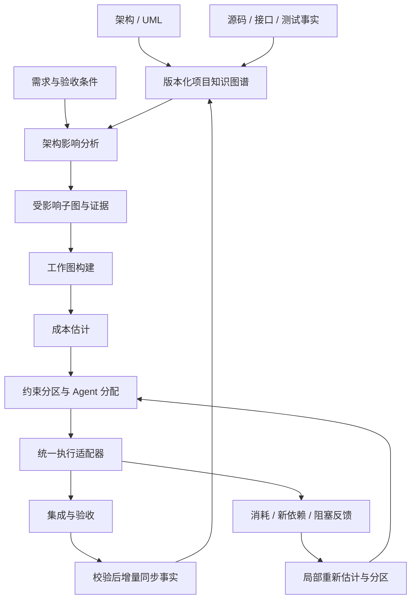

# Architecture-aware Dynamic Scheduling

> 状态：设计提案 v0.1；P1 静态只读委派与 P2 有界动态只读调度已实现；P3 隔离并行写入仍为提案。
>
> 日期：2026-09-27。
>
> 目标：利用架构与源码知识图谱，为大型代码仓生成范围明确、负载相对均衡、协作成本可控的 Agent 工作包，并根据执行反馈局部调整分配。
>
> 本文既描述已落地的第一版，也描述后续目标。实施状态以第 17 节和当前代码为准。

## 1. 设计决策

采用以下主流程：

```text
Requirement
  → Architecture Impact
  → Affected Subgraph
  → Workload Estimation
  → Balanced Graph Partition
  → Agent Assignment
  → Runtime Repartition
```

落地时，在受影响子图与工作量估计之间增加“生成工作图”：项目实体描述已有事实，工作项描述本次需求需要完成的动作，二者通过实体引用关联。

核心决策：

1. **知识图谱决定范围与关联**：架构层表达设计意图，源码层表达实现事实，保留映射、版本、来源和不一致状态。
2. **工作图决定任务与顺序**：生成探索、设计、修改、验证、集成工作项，显式记录依赖和交付物。
3. **成本模型决定负载估计**：先采用可解释的相对分数，再用实际执行数据校准 Token 与耗时预测。
4. **优化函数决定候选方案优劣**：同时考虑最大分区负载、跨分区协作和修改冲突；采用有界启发式搜索。
5. **运行时决定执行合法性**：检查任务依赖、写入归属、审核、版本、预算和租约，模型负责提出计划与解释。
6. **动态调整从待执行工作开始**：冻结运行中的写任务；只在明确交接点允许迁移。
7. **渐进交付**：先验证影响分析和静态分区，再加入动态调度与隔离并行写入。

“均衡”指预计剩余工作与执行能力相匹配，允许为了接口内聚性保留适度负载差异。Agent 数量受上限约束，可以使用更少的 Agent。

## 2. 目标与首版范围

### 2.1 目标

- 从超大型项目中按需选取相关上下文，避免向每个 Agent 注入整个仓库。
- 根据组件、接口和源码依赖形成可独立交付的工作包。
- 控制最重工作包的负载、重复理解、跨包返工和修改冲突。
- 每次委派都有可追溯的范围、分区原因、成本估计和验收依据。
- 新发现依赖或估计偏差时，能够调整剩余任务并保留已完成成果。
- 复用当前 Agent、工具、设计审核、契约检查、Trace、Run 和评测基础。

### 2.2 首版边界

首个执行版本限定为单后端进程、一个根调度任务、最多两个并行只读子 Agent；实际修改由主 Agent 统一完成。分区先优化探索负载，记录后续修改与验证工作的依赖。

首版不要求全局最优分区、自动学习模型权重、运行中 Agent 热迁移或分布式工作队列。首版也不声称已解决整个开发任务的并行负载均衡；该能力在隔离写入和执行成本校准阶段交付。

## 3. 当前基础与缺口

| 现有入口 | 已有能力 | 本方案需要补充 |
|---|---|---|
| `backend/app/agent_base/core/knowledge_graph.py` | `locate`、`expand`、`impact`、`contract_facts`、`index_facts`、`sync_facts` | 可版本化的有界子图查询、覆盖率与截断元数据、调度特征 |
| `extensions/knowledge_graph/` | SQLite 图存储、UML/源码关系、ArtifactFacts 投影与增量同步 | 面向变更语义的影响分析、层级摘要、待解析和陈旧状态 |
| `extensions/knowledge_graph/tools.py` 的 `impact()` | 反向邻接 BFS，区分直接与传递依赖 | 按关系与变更类型传播，返回证据、停止原因和未展开边界 |
| `backend/app/agent_base/core/orchestration.py` | `prepare()` 稳定接口、NoOp 与加载失败降级 | 版本化计划、结果反馈及重新规划协议 |
| `extensions/orchestration/architecture_aware/` | 图谱影响分析、成本估计、分区、分派和按需只读探索 | 跨运行的全局资源协调 |
| `backend/app/agent_base/tools/my_tools/subagent_tool.py` | 子 Agent 工具包、预算、Trace 和证据 | 结构化工作包输入/结果、子 Run 身份、生命周期适配 |
| `backend/app/agent_base/tools/task_system.py` | JSON 任务存储、DAG、claim/complete、worktree | 分区归属、计划版本、剩余工作状态与原子调度 |
| `backend/app/services/run_state.py` | SQLite Run 状态与租约 | 父子执行关联、调度恢复适配 |
| `backend/app/services/change_set.py` | 即时写入的变更记录与回滚支持 | 项目写入协调；它本身不提供并行修改隔离 |
| `backend/app/services/agent_execution.py` | 执行生命周期、审核、checkpoint、证据和终态 | 调度入口及子执行适配，避免复制整套执行链 |

当前 `TaskStore` 使用实例内 `RLock`，不能据此推断多个实例或进程间的原子领取安全。当前会话租约也不能代替项目级写入协调。

当前生产子代理注册受工具包和单次调用限制；新增调度执行器需要显式装配，不能仅通过提示词假定多次并行委派已经可用。

## 4. 总体结构



### 4.1 两种图与一种执行视图

**项目知识图谱 `G_K`**：持久保存组件、类、接口、方法、文件、测试及其关系。包含架构意图和实现事实，关系有方向、类型、来源与版本。

**需求工作图 `G_W`**：一次根任务的工作项及关系，引用 `G_K` 实体。它包括两类独立的边：

- `depends_on`：前置任务必须完成并产生有效产物，形成有向无环执行依赖。
- `coupling`：共同理解、共同变更或接口协作成本，用于分区评分。可以从有向知识关系投影成加权无向关系，但保留原始语义引用。

**执行视图**：分区到 Agent 的映射、就绪队列、Run、租约、预算和工作区。分区负责归属，依赖负责执行顺序；一个分区内允许多个按顺序执行的工作项。

不能把所有源码依赖都转为 `depends_on`，也不能把依赖边仅折算成切边权重而丢失执行约束。

## 5. 知识图谱维护与影响分析

### 5.1 来源、身份与版本

优先通过当前 ArtifactFacts 和 UML 构建链采集事实。确定性解析提供符号、导入、接口、测试关联；模型提供语义映射候选，必须保留证据和置信度，不能直接成为已确认依赖。

建议补充以下元数据：

| 对象 | 必要元数据 |
|---|---|
| 实体 | `entity_id`、项目、语言、限定名、路径、源码位置、内容指纹、来源 |
| 关系 | 类型、方向、证据位置、来源版本、置信度、确认状态 |
| 索引快照 | `graph_revision`、文件清单指纹、解析器版本、成功/失败/待更新范围 |
| 架构映射 | 设计实体与源码实体引用、映射证据、漂移状态 |

大仓中同名类和函数普遍存在，实体定位需要文件或限定名作用域；不得单纯按短名称合并。重命名通过映射维护身份；无法确认的迁移标记为待核实。

解析失败时保留旧事实供参考，但标为陈旧。模型的发现先进入候选事实集合，源代码或契约校验通过后再进入正式索引。计划中新实体使用任务作用域临时 ID，实际创建后关联正式实体。

### 5.2 按需求解释影响

需求先产生 `RequirementSpec`：目标、验收条件、约束、候选组件和变更类型。通过名称、全文检索、架构映射定位种子实体，并回读相关源码确认。

| 变更类型 | 优先展开范围 | 停止/收缩依据 |
|---|---|---|
| 方法内部实现 | 局部实现、直接行为测试、必要调用上下文 | 对外契约未变，相关行为已覆盖 |
| 公开接口或签名 | 实现者、调用者、跨语言绑定、契约测试 | 下游确认不受变更影响 |
| 组件边界或交互 | 组件依赖、设计—源码映射、关键调用链 | 组件接口与影响边界已确认 |
| 数据结构或配置 | 生产者、消费者、序列化、配置读取和测试 | 字段/格式兼容性有证据 |

展开方向由关系语义决定：既需要反向查找受影响调用者，也可能需要正向理解被调用实现，以及沿测试/设计映射展开。不能对所有边统一执行反向 BFS。

### 5.3 输出三类范围

- `modify_candidates`：预计需要修改的实体和文件，最终写入权限由运行时与用户授权确定。
- `read_context`：理解任务所需的上下文，允许被多个工作包共享。
- `verify_scope`：必须验证的接口、行为、测试与设计契约。

同时返回 `evidence_refs`、`unresolved_relations`、`stale_artifacts`、`truncated`、`frontier` 和停止原因。达到节点或 Token 上限表示本次查询截断，不表示影响范围完整。

对动态调用、反射、配置驱动和未支持语言，记录未知关系，并通过定向文本搜索、源码阅读或受控验证补证。低覆盖率时缩小并行范围，必要时使用一个 Agent 完成进一步探索。

### 5.4 大项目访问策略

先查询系统/组件摘要，再展开模块和符号；只读取需求相关内容。图查询使用索引、批量邻接和分页，返回有界数据，完整结果通过引用获取。

优先按内容指纹增量解析；缓存键包含项目、需求范围、图谱版本、源码版本和提取器版本。每个根任务固定一个基线快照，新发现通过版本化补丁进入计划。多个 worktree 的未合并事实保存在各自任务覆盖层，避免互相污染正式项目图。

首版继续使用当前 SQLite Provider；是否引入其他存储由节点/边规模、增量索引耗时、查询 P95 和内存测量决定。

## 6. 工作图与工作包

工作项以可验收产物为边界，如“确认滤波接口影响”“实现滤波策略”“更新处理链接入”“验证端到端行为”。每个工作项包含目标、实体引用、输入、输出、权限和验收条件。

工作类型为 `explore`、`design`、`modify`、`verify`、`integrate`。读取某个节点本身不必生成独立 Agent 任务；可以归并为一个完整的探索目标。

工作图必须包含最终集成与全局验收节点。子任务完成仅表示其局部验收通过，不等同于根需求完成。

在分区之前验证：

- 依赖 DAG 无环；发现循环时先修正计划或创建共同接口工作项。
- 同一共享文件的写任务有唯一负责人，或者通过串行依赖明确版本交接。
- 强制共同修改的实体可合并成不可拆工作单元。
- 架构变更对应设计审核前置任务；未批准不得启动相应实现。
- 每个工作项的验收条件能由产物或证据判断。

合并工作项后重新检查依赖。调度始终保留工作项级 DAG；如果另外构造分区级 DAG，必须检查压缩是否引入循环，不能直接按分区整体阻塞。

工作包分为独占修改范围与可共享阅读上下文。公共接口可被多个 Agent 阅读，其修改必须具有明确所有者。共享工具类不能仅因图度数高，就把所有使用方强制合并。

## 7. Exploration Cost Model 与工作量估计

### 7.1 初始探索模型

以下公式是本项目提出的设计目标，不是对某篇论文公式的引用：

\[
\widehat C_E(v\mid r,K_a)=
\alpha\widetilde{Tokens}(v)
+\beta\widetilde{Symbols}(v)
+\gamma\widetilde{Dependencies}(v)
+\delta\widetilde{Complexity}(v)
+\epsilon\widetilde{ChangeImpact}(v)
\]

其中，`r` 为本次需求，`K_a` 为 Agent 已掌握且版本仍有效的上下文；各特征均针对需求相关范围。

| 特征 | 可提取定义 | 初期处理 |
|---|---|---|
| Tokens | 必要源码片段、接口与摘要的预计 Token | 从索引范围和 tokenizer/统一估算器取得 |
| Symbols | 需要理解的相关符号数量 | 按类、函数、类型等提取；排除无关符号 |
| Dependencies | 尚未理解的相关依赖负担 | 按关系类型加权，稳定公共只读接口权重较低 |
| Complexity | 控制流、嵌套、动态行为等理解难度 | 使用语言适配器；缺失标记未知，不计为零 |
| ChangeImpact | 为确认本次变更影响还需检查的范围 | 使用去重后的影响候选和不确定性，避免重复累加路径 |

特征归一化使用版本化的固定参考统计量，例如 `log1p(x) / log1p(max(1, reference_p90))`。没有历史数据时，从首批已提取特征形成并保存初始参考表；参考值在一次根任务内冻结，不随候选分区重新计算。原始量、归一化量和超出参考范围的情况均保留。缺失特征暂用参考表的保守值并降低置信度，不能视为零成本。

首版系数可初始化为非负等权并归一化为和为 1，仅作为可复现的启发式基线；它不具有经验精度保证。Tokens、Symbols、Complexity 和影响范围之间可能相关，需要通过后续消融与拟合调整，避免重复计算。

### 7.2 置信度与探索价值

成本输出包含点估计、保守估计、置信度、缺失特征和主要贡献。首版高/中/低置信度由索引新鲜度、支持语言和关系证据规则确定，不解释为统计概率。

调度以保守估计检查工作包规模。实际 Token、时间、工具调用上限仍由当前运行时计数器独立强制执行，相对成本分数不代替资源限额；已经读过且未变化的上下文可以降低后续探索负担，但不能据此抹去实际 API 输入 Token 成本。

ChangeImpact 还影响探索优先级。另存风险/预期信息收益，先覆盖验收必需和高风险未知范围；不能只按最低成本选择节点。选择探索动作时同时检查必要性、预算与潜在信息收益。

### 7.3 工作包成本

分区内先按 `artifact + revision + span` 去重必要阅读内容，再估计关系理解与边界探索；不能直接将所有节点的公共依赖成本相加。分区间重复阅读则计入各自负载。

完整开发工作包的成本为：

\[
\widehat C(P_i,a_i)=
\widehat C_E(P_i\mid r,K_{a_i})+
\widehat C_M(P_i,a_i)+
\widehat C_V(P_i,a_i)
\]

`M` 表示修改，`V` 表示验证。首版只读版本以 `C_E` 评分；完整执行版本将修改规模、接口变更、既往检查耗时等映射到统一工作量尺度后加入 `M/V`。跨 Agent 协调作为优化函数独立项，避免再次加入 `C` 重复惩罚。

初期输出相对分数，不将它宣称为秒或 Token。积累数据后分别预测 `estimated_tokens`、`estimated_active_seconds` 和 `verification_seconds`；人工审核等待、外部阻塞与主动执行耗时分别统计。

## 8. 分区优化目标与算法

### 8.1 目标函数

设 `P` 为工作项划分，允许最多 `k` 个非空分区。用户提出的原始目标为：

\[
\min_P\left[\max_i C(P_i)+\lambda\sum CutEdges(P)+\mu Conflict(P)\right]
\]

落地采用归一化形式：

\[
J(P)=
\frac{\max_i\widehat C(P_i)}{C_0}
+\lambda\frac{\sum_{e\in E_{cut}(P)}w_e}{E_0}
+\mu\frac{\widehat F(P)}{F_0},\qquad P\in\mathcal F_k
\]

- `C0/E0/F0` 为正的参考尺度，在同一次初始分区或重分区比较中固定。
- `λ/μ` 控制协作和冲突风险偏好，首版均可设为 1，作为待评测的起点。
- `F_k` 是满足硬约束的候选集合，允许少于 `k` 个分区。
- 第一项降低最重分区负担，不要求完全等负载，也不直接等价于考虑依赖后的总完成时间。
- 首版同构 Agent；异构 Agent 阶段联合考虑 `C(P_i,a_i)`，避免把模型吞吐率当作恒定能力系数。

`w_e` 表示本次任务切开该耦合关系后预计产生的接口交接、协商或返工负担。公共内容重复阅读已进入各分区 `C_E`，不在切边项重复计算。`contains` 等纯结构边不自动视为通信成本。

`F(P)` 表示剩余语义冲突风险，如不同文件对同一接口、配置或数据结构产生不一致修改。相同事实同时影响 `w_e` 和 `F` 时，分别解释交接负担与不兼容风险，并在校准中检查重复惩罚。

首版可将交接关系按低/中/高负担赋值 `1/3/5`，对无需交接的关系赋值 `0`；冲突风险按共享契约去重，以固定规则汇总低/中/高风险分值并保留原因。参考尺度可取初始架构分区对应项的值并设置正数下限，随后冻结。上述映射、参考表和系数一起写入成本模型版本；只读阶段未产生修改风险时 `F(P)=0`，不得人为制造风险分值以平衡公式。

### 8.2 硬约束

- 权限是根任务权限的子集，成本收益不能交换权限扩大。
- 一个工作项只能有一个当前所有者；执行租约失效者不能提交结果。
- 共享工作区并发写入范围不重叠；首版所有实际修改只有一个执行者。
- 不可拆工作单元必须同组；过大时增加明确的接口阶段，或保留单 Agent，不能强行切开。
- 每个工作包满足上下文、预算、工具能力和验收要求。
- 任务启动满足工作项级依赖与设计审核，文件版本与产物有效。
- 必要串行任务即使导致暂时空闲，也不能为追求均衡提前执行。

若用户未提交修改存在，隔离工作区必须从包含这些修改的已记录快照生成，不能默认以 Git HEAD 代表当前需求基线。

### 8.3 首版启发式

1. 验证工作图，合并强制共同分组的工作项。
2. 按架构组件形成初始组，计算包含边界上下文的成本。
3. 构造一个分区到 `k` 个分区的有限候选；以固定顺序处理，确保可复现。
4. 对过重组尝试拆分可独立验收的工作项，对小组尝试合并。
5. 尝试移动或交换边界工作项，每次重新计算去重成本、切边和冲突。
6. 拒绝违反硬约束的候选，仅接受目标函数有足够下降的候选。
7. 达到迭代上限或无改善时停止，保留最好可行方案和各项分数。

```python
plan = component_seed(work_graph, max_agents=k)
best = validate_and_score(plan, frozen_cost_model)
for _ in range(max_iterations):
    candidates = bounded_boundary_moves(best.plan)
    feasible = [p for p in candidates if satisfies_constraints(p)]
    candidate = lowest_score(feasible, default=best)
    if best.score - candidate.score <= min_improvement:
        break
    best = candidate
return best
```

这是算法示意，非已有 API。分区数量受约束，启动与上下文准备成本进入每个非空分区的估计；小任务可直接使用一个 Agent。

算法先在任务压缩图上运行，限定候选邻域、迭代次数与规划预算。后续可用 METIS 等算法生成候选，但仍需验证工程硬约束和任务依赖。

## 9. Agent 分配与执行

### 9.1 工作包交付

每个 Agent 只接收：目标与验收条件、负责实体和文件、必要只读上下文、输入产物引用、边界契约、图谱/源码版本、工具权限、预算及停止条件。

Agent 不复制完整父会话，不自行扩大写入范围，不递归创建子 Agent。发现新依赖时返回结构化发现，由协调器修订计划。相同模型、提示词基础和工具执行器通过工作包参数复用，首版无需建立常驻专家团队。

同等可行情况下优先选择掌握相关有效上下文的 Agent；随后比较预计完成负担。调度器只派发前置任务已验收的就绪工作项，优先考虑关键依赖链，不能以最小切边为由忽略串行瓶颈。

### 9.2 写入与验证

首版并行读取固定基线，主 Agent 汇总后统一写入。后续读任务必须引用更新后的版本，不能将修改前的分析当作修改后的事实。

并行修改阶段为每个写 Agent 创建隔离 worktree 或副本，绑定所有文件工具、命令工作目录、输出目录与契约检查。worktree 只是文件隔离基础，仍需约束命令和外部副作用。

修改结果由集成执行者按依赖顺序合入候选工作区；冲突转为显式集成任务。最终在集成后的同一版本执行验收。单个分区验证成功不能代替集成验证。

验证工具可能生成缓存和构建产物，因此需要隔离输出或串行运行冲突命令。测试或契约规则通过与否以结构化证据判断，不能仅依赖 Agent 的完成摘要。

## 10. Runtime Repartition

### 10.1 触发条件

运行时收集实际消耗、剩余工作估计、新依赖、阻塞、产物版本和验收结果。触发局部调整的情况包括：

- 某个工作包发现超出原范围的必要依赖。
- 预计剩余负载持续偏离其他活跃 Agent，并存在可转移工作。
- 工作包预计突破上下文或预算上限。
- Agent 失败或阻塞，剩余工作可由其他执行者继续。
- 接口或架构契约变更，使原工作边界失效。

新依赖导致计划无效属于正确性修复，立即停止受影响任务；普通负载波动则需要超过阈值并经过冷却时间。人工审核等待不应自动解释为 Agent 处理能力不足。

### 10.2 调整目标

对未完成工作优化：

\[
J_t(P')=J_{remaining}(P')+
\nu\frac{Migration(P\rightarrow P')}{M_0}
\]

迁移成本包括上下文重新建立、交接证据、已有产物处理和必要重验证。比较旧/新方案时使用同一剩余工作集合、同一成本模型版本和参考尺度；本轮预算已消耗部分仍计入总账，但不作为剩余负载。

### 10.3 首版调整协议

1. 暂停新的受影响任务派发，保留无关任务继续执行。
2. 固定已完成工作与正在运行的工作；仅重新划分 pending/ready 工作。
3. 根据新发现更新局部工作图和保守成本，重新验证依赖与权限。
4. 计算包含迁移成本的新方案；收益不足则保留原分配。
5. 原子提交新的 `plan_revision` 与工作归属，再恢复派发。
6. 子结果携带 plan revision、attempt 和 lease token；校验归属、租约与输入版本。仅计划其他部分变化不使无关结果失效，失效结果隔离待核对。

运行中的写工作需要先停止于检查点，释放旧租约并生成交接包，才能在后续版本支持迁移。不得同时给新旧 Agent 发放同一写任务。

## 11. 最小数据契约

以下均为建议的新字段，采用可序列化、版本化模型；大段源码和日志通过引用传递。

| 模型 | 核心字段 |
|---|---|
| `RequirementSpec` | `id`、目标、约束、验收条件、变更类型、根权限 |
| `GraphSnapshotRef` | `project_id`、`graph_revision`、文件清单指纹、解析器版本、覆盖状态 |
| `ImpactSlice` | 种子、修改候选、阅读上下文、验证范围、证据、未知关系、截断/陈旧状态 |
| `WorkItem` | `id`、kind、目标、实体引用、`depends_on`、输入/输出、read/write scope、验收、cost、status |
| `CostEstimate` | 原始/归一化特征、explore/modify/verify 分数、保守估计、置信度、模型版本 |
| `PartitionPlan` | 根 Run、计划版本、图谱/工作区版本、工作归属、边界契约、各项评分、固定参考尺度 |
| `AgentAssignment` | Agent、工作项/分区、工具集、权限、上下文引用、工作区、预算、租约 |
| `WorkResult` | 工作项、attempt、子 Run、输入与输出版本、产物/证据、验证结果、发现、阻塞、实际消耗 |

逻辑工作状态建议为 `pending → ready → running → succeeded`，另含 `blocked/failed/canceled`。`ready` 由依赖和约束派生；执行暂停、等待审核、超时等继续使用现有 Run 状态，通过明确映射影响工作状态。

只有验收器确认结果有效后，工作项才能进入 `succeeded`。输入版本变化使相关成功产物过期时，创建新 attempt 并只失效对应下游依赖。

## 12. 持久化、预算与恢复

- 工作图、计划和分配保存为不可变 revision；当前计划指针与归属变更通过事务/CAS 提交。
- RunStore 继续拥有实际执行状态和租约；调度记录引用其 run_id，不维护第二套子 Run 终态。
- 首版规划报告可以是 JSON 产物；启用可恢复动态调度前，使用同一 SQLite 数据库中的调度表或受事务保护的存储适配器，实现原子领取和 revision 校验。
- 现有 TaskStore 通过适配展示工作项；每个调度任务只有一个权威状态来源，避免 JSON 和数据库双写后各自成为真相源。
- 一次根任务设置共享 Token、时间和工具预算。派发前预留子额度，完成后结算并归还剩余额度；保留主 Agent 汇总和最终验证额度。
- 根任务停止向所有子执行传播，保存产物与检查点；外部命令也要终止或确认退出，之后才释放可写工作区。
- 崩溃恢复先核对租约、已有进程、输入版本和已提交产物，再恢复待执行工作。文件应用与结果提交使用幂等键和版本前置条件，避免重复写入。
- 图谱查询或规划在产生副作用前失败，可返回单 Agent 路径并说明原因；产生修改后必须恢复/交接现有状态，不能从头静默重跑。

## 13. 与当前代码的接入方式

### 13.1 建议模块布局

```text
backend/app/agent_base/core/
  scheduling.py                  # 新增：请求、工作项、计划、结果与策略端口
  knowledge_graph.py             # 扩展：快照、有界子图与覆盖元数据

extensions/orchestration/
  architecture_aware/
    impact.py                    # 需求到影响切片
    work_graph.py                # 切片到工作图
    cost.py                      # 特征、成本及置信度
    partition.py                 # 可行性检查、评分、局部搜索
    assignment.py                # Agent 匹配与就绪工作选择
    policy.py                    # 重分区触发与有界修订

backend/app/runtime/
  scheduling_runtime.py          # 子 Run 执行、权限、取消、预算与工作区适配

backend/app/services/
  scheduling_store.py            # 计划 revision 与工作归属；适配现有 RunStore
```

以上是职责划分，首版可合并小模块。算法和知识图谱具体存储留在 extensions；核心端口不反向导入具体插件。WebSocket 只适配事件，不实现调度策略。

### 13.2 端口演进

保留现有 `prepare()` 端口供普通编排使用；架构感知组件通过它提供轻量工具提示。影响分析与分区由主 Agent 的探索诉求触发。多轮运行时调度使用新的策略端口，建议职责为：

```text
plan(requirement, graph_snapshot, capabilities) → PartitionPlan
revise(plan, execution_feedback, graph_delta)   → PlanRevision
```

策略端口只产生计划；执行适配器校验后运行。新端口的能力声明通过插件管理器显式检查，避免旧 Provider 被当成支持动态调度。

统一子 Run 入口接收 `AgentAssignment`，复用当前 assembly、工具执行和证据基础。首版可以适配当前子代理循环；后续逐步收敛生命周期，不能通过无限次调用私有 `_execute()` 模拟可靠调度。

### 13.3 开关与兼容

继续遵循此前约定：关闭新策略后恢复当前执行行为，包括已有独立的主 Agent 子代理配置。无需为此先建设通用编排平台。

收缩后只保留一个编排总开关 `AGENT_ORCHESTRATION_ENABLED`。关闭时插件不加载，主 Agent 走单 Agent 流程；开启且项目图谱可用时提供架构感知调度。开启但图谱、项目或只读探索器不可用时，记录原因、移除架构调度工具并继续走单 Agent 流程，不再回退到通用 LLM 规划器。主 Agent 自身的子代理开关保持独立。

当前 Settings 按进程缓存，配置切换需要重启后端。checkpoint 保存首次运行的图谱调度模式、计划版本和根 Run 标识；恢复时不将原本关闭的任务自动切入图谱调度，显式关闭开关仍立即退回现有流程。恢复会重新检查图谱和文件指纹，不匹配时建立新计划，不能复用旧摘要。

未来可增加 `off|observe|execute` 模式，让显式评测仅生成分区报告。首版已使用最多 2 个子 Agent、委派深度 1、局部搜索 20 轮；普通重分区的冷却与收益阈值仍为后续提案。

## 14. 示例：新增雷达滤波策略

假设需求为“增加自适应滤波策略并接入处理链，保持现有策略兼容”。

1. 在架构图定位滤波组件及处理链，在源码中确认策略接口与配置入口。
2. 提取实现者、调用者和相关测试；稳定的公共类型作为只读上下文共享。
3. 生成工作项：接口影响确认、必要设计修改/审核、策略实现、配置与调用链接入、局部验证、集成验证。
4. 接口确认/审核为实现和接入的共同前置条件；实现与接入在契约稳定后才允许并行。
5. 若二者实际修改同一文件，则合并工作包或串行执行；不能因为图上的实体不同而放开并发写入。

示意分区：

| 工作包 | 主要范围 | 初始相对成本 | 执行条件 |
|---|---|---:|---|
| A | 滤波策略实现与局部验证 | 40 | 接口契约确定 |
| B | 配置/调用链接入与局部验证 | 35 | 接口契约确定 |
| 集成 | 合并产物、端到端验证、设计一致性 | 15 | A/B 验收通过 |

这些数值是示例，不是测量结果。总完成时间还包含共同前置任务与集成，不能直接解释为 `max(40,35)`。

若 A 在执行时发现新数据格式依赖，先判断是否改变公共契约：改变则暂停受影响实现并更新设计/工作图；只增加独立探索工作时，将其分给空闲 Agent，完成后回传证据。只有节省的剩余工作超过迁移成本，才调整已有待执行任务。

## 15. 分阶段实施与验收

| 阶段 | 交付物 | 验收条件 |
|---|---|---|
| P0：可观察规划 | 需求契约、版本化影响切片、工作图、探索成本、分区报告 | 不改变执行路径；能解释每个范围、分区和评分；未知/截断可见 |
| P1：静态只读委派 | 最多两个探索子 Agent、结构化结果、共享预算、统一修改和验收 | 不越权写入；结果可归因；覆盖必要影响范围；与当前单 Agent 对比 |
| P2：待执行工作动态调整 | 子 Run 关联、持久化计划、原子归属、局部重分区、取消恢复 | 不重复领取；旧租约不能提交；恢复复用有效产物；迁移成本可观测 |
| P3：隔离并行修改 | 工作区快照、受约束写 Agent、统一集成、集成后验证 | 用户基线被保留；同文件冲突可识别；审核不绕过；整体质量和成本达到推广标准 |

P0 先证明图谱能产生可靠工作包；P1 检验探索成本与委派价值；P2 才引入动态性；P3 才验证完整开发工作量均衡。

### 15.1 评测设计

复用现有评测入口与生产工具链，比较：当前单 Agent、按文件数量分配、按架构静态分配、加权静态分配、动态调整。使用相同需求、项目快照、模型配置与总预算，记录索引冷热状态和多次运行波动。

覆盖局部修改、跨组件接口变更、高度共享公共类型、动态依赖缺失、新实体创建、图谱陈旧、运行中失败/暂停、用户已有修改、同文件多实体与多语言绑定等场景。

| 维度 | 指标与解释 |
|---|---|
| 正确性 | 根任务验收通过率、设计契约违规、遗漏影响实体/接口 |
| 影响分析 | 人工/确定性检查辅助标注的必要范围召回、无关范围扩张率；实际修改文件不能单独作为真值 |
| 成本预测 | 预计/实际阅读量、Token、主动执行时间误差，按类型与置信度分组 |
| 均衡 | 可并行工作阶段的最大/平均负载比、空闲时间、关键路径等待 |
| 协作 | 跨包交接、重复阅读、返工、集成冲突 |
| 总效率 | 端到端耗时、总 Token/费用、规划与索引开销 |
| 动态收益 | 重分区次数、迁移成本、调整后的剩余完成时间；通过对照运行估计收益 |
| 可靠性 | 重复领取、过期提交、取消残留进程、恢复成功率 |
| 规模 | 节点/边数、影响切片大小、查询 P95、规划耗时和内存 |

正确性和权限约束为推广硬门槛。性能阈值在 P0 基线测量后确定并冻结到评测配置；只有总效率或通过率获得可重复改善，才扩大并发。单纯降低优化分数或提高负载均衡不视为成功。

### 15.2 观测事件

新增事件建议包括 `impact_slice_created`、`work_graph_created`、`partition_scored`、`assignment_created`、`work_result_received`、`repartition_proposed`、`plan_revision_committed` 和 `integration_verified`。

事件携带 root/child run、work item、attempt、plan revision、图谱/源码版本、模型版本、评分分量、预算和证据引用。前端先显示任务树、等待原因和交付物；完整图谱可视化作为后续功能。

## 16. 相关文档与方法参考

- [当前架构](current-architecture.md)：生产执行链与模块边界。
- [知识图谱](knowledge-graph-design.md)：图实体、构建与查询基础；具体行为以当前源码为准。
- [设计—源码契约](design-source-contract.md)：权威关系、影响分析、审核和一致性规则。
- [插件架构](plugin-architecture-design.md)：Provider 加载与可选扩展边界。
- [预算与收敛](agent-convergence-and-budget.md)：现有执行治理基础。
- [评测体系](evaluation-system.md)：生产链路一致的评测与结果归档。
- [METIS 官方手册](https://karypis.github.io/glaros/files/sw/metis/manual.pdf)：加权、多约束图划分以及边切割量/通信量目标，可用于后续候选算法选型。本文的工程成本、冲突与迁移目标为项目自定义设计，METIS 不直接提供完整的 Agent 调度语义。

## 17. 第一版实施状态与启用方式

实现位于 `extensions/orchestration/architecture_aware/`。`extensions.orchestration:create` 只创建架构感知调度器；编排总开关关闭时由插件管理器提供 NoOp 路径。图谱不可用时，Provider 返回带原因的不可用状态，不再启动通用规划器。

要启用图谱调度，需同时设置：

```env
AGENT_ORCHESTRATION_ENABLED=true
AGENT_ORCHESTRATOR_PROVIDER=extensions.orchestration:create
AGENT_KNOWLEDGE_GRAPH_ENABLED=true
```

当前代码新增的可选参数为 `AGENT_ARCHITECTURE_SCHEDULING_MAX_WORKERS`（默认 2，上限 2）、`AGENT_ARCHITECTURE_SCHEDULING_TOTAL_TOKENS`（默认 32000，探索阶段分配额度）和 `AGENT_ARCHITECTURE_SCHEDULING_WORKER_SECONDS`（默认 90）。环境变量变更后按现有 Settings 生命周期重启 backend。

当前执行路径：

1. 主 Agent 启动时，编排组件的 `prepare()` 读取有界项目图谱地图，提供少量候选架构名称和路由提示；不调用规划模型或子 Agent。图谱不可用时只提供提示，不阻断主流程。
2. 遇到跨组件的不确定性时，主 Agent 在广泛读取源码前调用 `route_architecture`，记录选择直接定点查找或图谱探索的原因；选择探索时提供具体目标与 1–4 个已观察到的名称。明确的局部修改可直接执行，不受固定读文件次数门槛限制。原 `explore_architecture(goal, search_queries)` 保留兼容。
3. 工具适配器通过 `ExplorationDemand` 将请求交给独立组件；组件通过当前 KG Provider 定位最多 4 个种子，有界展开直接邻居与反向影响，最多保留 36 个节点。
4. 组件按文件边界构建只读探索单元，依据探索成本、跨组关系与负载目标分区。无法形成有价值的并行切片时返回 `not_delegated`，主 Agent 直接核查。
5. 可以并行时，组件分配共享探索预算、最多两个只读 `strategy` 子 Agent，并通过 `ExplorationReport` 返回证据摘要、未解决项、分区评分、计划修订号及子 Run 标识。主 Agent 保留全部修改、审核、checkpoint、验证和终态职责。

`ExplorationDemand`、`ExplorationReport` 和 `ExplorationPort` 定义在 Agent 核心接口层；路由工具、图谱影响分析、分区及调度策略定义在可选扩展内。主流程只依赖工具注册和 `prepare()` 端口。子 Agent 的累计 Token 限制在下一次模型请求前根据估计上下文检查；单次请求的实际用量可高于估计，因此不是绝对计费上限。Trace 的 `route_architecture` 调用及结果分别记录 `direct` / `explore` 和决策原因；只有 `explore` 才会进入调度器。`orchestration_preparation` 记录调度可用状态、不可用原因和路由图信息；准备阶段不再调用规划 LLM 或启动探索 Agent。

当前成本系数与 `1/3/5` 关系权重是固定启发式，不是从评测拟合的结果。当前版本使用现有图谱实体和直接邻居；源码层需要已有索引，若索引只含设计层，子 Agent 会继续核对源码。现有源码图谱对语言和动态关系的覆盖有限；持久化的是所选影响切片的指纹、工作归属和摘要，不是完整版本化图快照。尚未实现新依赖触发的工作图扩张或隔离并行写入。代码/索引不一致时，主 Agent 仍须核对文件事实。

## 18. P2 有界动态只读调度的实现范围

`scheduler.py` 按共享 Token 预算决定工作项粒度：默认 32000 Token 时两个分区各保留一个工作项；预算足以让四项各获得约 12000 Token 时，才按文件边界拆出后续波次。最多两个只读子 Agent 同时执行。`store.py` 使用 RunStore 所在 SQLite 数据库持久化计划版本、工作项归属、领取令牌、结果及重分区事件；每项执行另建关联根 Run 的子 Run，租约由 RunStore 管理。领取、结果提交和待启动任务迁移均以事务和版本条件保护。子 Agent 完成后，调度器用实际耗时与估计成本更新两个执行槽的速度估计；预测最大剩余耗时改善至少 10% 且目标槽空闲时，仅迁移未领取的工作项。

恢复时，匹配需求、所选图切片、项目文件及可定位源码文件指纹的计划可复用已提交摘要；终态子 Run 的结果从 RunStore 元数据补交，过期租约对应工作项可重新入队。取消的子 Run 保留终态，后续恢复重新领取对应工作项。单次执行仍受探索 Token 总额度与每个子 Agent 的时间、Token、工具调用上限约束；预算不足或图谱失效时工具返回 `unavailable`。计划事件保留 `plan_created`、`item_claimed`、`item_finished` 和 `repartition`，工具结果携带计划 ID、修订号、子 Run 及分片统计。

每个工作项在委派前从受限源码目录与项目 UML 文件提取少量带行号的摘录；路径越界的图谱文件引用不会被读取。仅有这些摘录、没有子 Agent 工具证据的结果标为 `partial`，未启动项在工具结果中显式计数；主 Agent 保留再次委派与逐文件核查能力。图谱切片达到 36 节点上限时，`partial` 不表示影响范围已完整覆盖。

这一步仅调度探索读取，主 Agent 仍负责全部修改、审核、验证与最终交付。当前局部重分区只根据耗时与空闲容量调整已有切片，没有根据子 Agent 自由文本报告自动增建依赖工作项；这需要结构化反馈和图谱增量一致性约束。

## 19. 探索结果与路由提醒的第二轮优化

图谱定位现在分别对每个搜索词保留一个最高相关种子，再按名称精确匹配、源码实体、方法类型与检索分数补齐种子名额，最多选取四个种子，避免宽泛名称独占候选。图谱仍只是候选索引；真实行为以文件工具读取为准。每工作项累计额度上限为 16000 Token；默认 32000 Token 共享预算在两个工作项之间按估计成本分配，单次模型请求的目标上限仍为 12000 Token。

只读子 Agent 被要求返回有界 JSON：最多三条带路径、起止行、符号、已核实行为和 `edit` / `dependency` / `test` 角色的发现，另列未解决依赖与排除的无关候选。组件只把能落在该子 Agent 成功 `read_file` 范围内的发现放入 `ExplorationFinding.evidence`；未通过核对的发现进入未解决计数。没有结构化文件证据的报告保留为 `partial`，不能标为已完整核实。主 Agent仍须在修改前读取精确修改点。

后续试跑发现较长的工作项常在生成 JSON 前触及累计额度，因此工作项提示进一步收缩为最多三次定点文件读取、最多三条发现，并把子 Agent 工具调用上限设为 6。`partial` 包括未核实依赖、报告缺少结构化证据或预算停止；它不表示子 Agent 已完成影响范围调查。

可选组件通过现有 Agent Hook 观察工具批次。在启用架构调度的主 Agent 广泛列出项目文件后，下一次模型请求收到一次短路由提醒，要求主 Agent自行选择 `direct` 或 `explore` 并记录原因。提醒不暂停工具、不预运行委派、不设置固定读文件次数门槛；模型请求返回后即从对话上下文移除。子 Agent 与关闭架构调度的运行不触发此逻辑。
