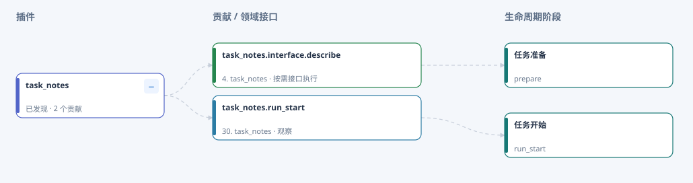

# 插件快速上手：从本地验证到执行回放

[English](plugin-quickstart.en.md) · [开发工具包](plugin-development.md) · [目录发现与配置](plugin-discovery.md)

这个示例展示如何让框架能力接入 ArchitectCoder 的公共阶段，以及如何查看它的实际执行记录。复用仓库内的 `task_notes`，无需修改核心代码。

## 先看效果，无需安装

下载 [中文架构图 HTML](media/plugin-demo/plugin-architecture-zh.html) 或 [English HTML](media/plugin-demo/plugin-architecture-en.html)，用浏览器打开。在 GitHub 文件页选择 **Download raw file**，保存为 `.html`；GitHub 文件页本身不会运行这个交互示例。

依次尝试：

1. 查看默认的主流程总览，找到模型调用前后、工具执行前后等公共阶段。
2. 点击插件列表中的 `task_notes`，进入插件详情和组织图。
3. 搜索 `task_notes.describe`，查看默认阶段 `prepare` 及按需接口声明。
4. 搜索 `task_notes.run_start`，查看挂接到任务开始阶段的观察贡献。
5. 点击“主流程总览”，再点击“全部展开”；按钮会切换为“全部收起”。

[](media/plugin-demo/task-notes-zh.svg)

*预览图由应用的架构图渲染器生成，展示示例计划中的真实声明关系。虚线表示绑定，不表示两个接口会自动按顺序执行。*

HTML 包含 7 个内置插件和 `task_notes`，使用仓库默认配置，部分可选插件处于禁用状态。它是离线只读架构快照，支持折叠、搜索、缩放和详情；实际任务回放在应用中查看。示例未添加故障记录，异常定位列表为空属于正常情况。

## 1. 理解最小插件

查看 [plugin.json](../examples/plugins/task_notes/plugin.json) 和 [实现](../examples/plugins/task_notes/__init__.py)。这个插件只有两项能力：

| 能力 | 接入方式 | 触发条件 | 预期结果 |
|---|---|---|---|
| `describe()` | `service`，默认绑定 `prepare` | 调用方显式请求接口 | 返回 `Task notes example` |
| `observe_start(context)` | `observer`，绑定 `run_start` | 主流程进入任务开始阶段 | 在当前 Trace 中写入一条 `plugin_example` 事件 |

阶段贡献会随阶段调度；service 只在明确调用时执行。声明 `describe` 不会自动让它成为模型工具，也不会让它在每次 `prepare` 时执行。Skill 用于模型侧的可复用指南，插件用于框架能力扩展。

## 2. 本地验证，无需启动应用或配置模型

在已经安装后端依赖的 Python 环境中操作，所有命令从**仓库根目录**执行。依赖安装见 [README 快速开始](../README_ZH.md#快速开始)。

检查实际接口：

```shell
python backend/plugin_dev.py check examples/plugins/task_notes --instantiate --output temp/plugin-demo-check.json
```

预期：`status` 为 `passed`，`diagnostics` 为空，`describe` 的 `implemented` 为 `true`。`--instantiate` 会创建示例 Provider 并检查接口，结束后释放其支持关闭的资源。

显式调用 service：

```shell
python backend/plugin_dev.py run examples/plugins/task_notes --method describe --output temp/plugin-demo-describe.json
```

预期：`result` 为 `Task notes example`，`events` 包含 `contribution_id=task_notes.interface.describe`、`mode=service`、`status=executed` 的记录。

触发阶段观察贡献：

```shell
python backend/plugin_dev.py run examples/plugins/task_notes --stage run_start --output temp/plugin-demo-run-start.json
```

预期：`status=passed`，`provider_instantiated=false`；`events` 包含插件写入的 `plugin_example`，以及调度器写入的 `task_notes.run_start` 执行记录。观察贡献无需创建 Provider。`result=null` 是正常结果。

以上报告来自本地独立调度上下文，保存为 JSON；它们不会进入应用的聊天 Trace 列表。每次执行生成的 ID 和耗时会变化。

## 3. 在应用中加载、执行和查看记录

在 `backend/.env` 中配置：

```dotenv
PLUGIN_ROOTS=["../examples/plugins"]
AGENT_TRACE_ENABLED=true
AGENT_TRACE_PROVIDER=extensions.trace:create
```

如果已有 `PLUGIN_ROOTS`，将示例路径追加到原有 JSON 数组。这里路径相对 `backend/`，与上面 CLI 相对当前目录的规则不同。完成模型配置并重启后端，按 [README](../README_ZH.md#快速开始) 启动应用。

1. 点击工具栏的 **插件架构**，找到 `task_notes`，确认声明状态为“已发现”，能看到两项贡献。发现成功不代表已创建 Provider。
2. 打开工作目录 [`examples/quickstart`](../examples/quickstart/)，在 AI 助手发送：“请简要说明这个项目的用途，只做分析，不修改文件。”这一步会调用配置的模型。
3. 任务运行结束后，打开 **插件架构 → 实际执行回放**，点击“刷新记录”，选择刚才的会话及任务。
4. 从步骤列表定位 `task_notes.run_start`，查看 `observer`、`executed`、`plan_id`、插件版本和耗时。图上会展开并高亮该贡献；可用上一步、下一步查看相邻记录。
5. 如需交付当前系统的架构说明，点击面板的 **导出 HTML**。它保存你的当前计划和显示状态，可离线分享。

这次任务会触发 `run_start` 观察贡献；`describe()` 的调用已经在本地验证中展示，不会因发送聊天消息自动执行。

新增插件放入已配置的扫描根目录后，可点击“扫描新插件”。首次增加扫描根目录、更新现有插件代码或配置仍需重启；无需为了本教程新增热加载机制。

## 4. 创建自己的插件（可选）

跑通示例后，生成一个独立骨架：

```shell
python backend/plugin_dev.py new demo_notes --root temp/plugin-demo-scaffold
python backend/plugin_dev.py check temp/plugin-demo-scaffold/demo_notes --instantiate
python backend/plugin_dev.py run temp/plugin-demo-scaffold/demo_notes --method echo --input temp/plugin-demo-scaffold/demo_notes/smoke.json
python backend/plugin_dev.py run temp/plugin-demo-scaffold/demo_notes --stage prepare
```

预期生成 `plugin.json`、`__init__.py`、`smoke.json` 和 `README.md`，随后三个命令均返回 `passed`，`echo` 返回包含 `text=hello` 的对象。`new` 不覆盖已有目录；重复体验时直接使用已生成的目录，或换一个名称。

这个临时骨架尚未接入应用。准备接入时，将其父目录加入 `PLUGIN_ROOTS` 并重启，具体配置见[开发工具包](plugin-development.md)。

## 遇到问题时

| 现象 | 检查方法 |
|---|---|
| 看不到 `task_notes` | 检查 `PLUGIN_ROOTS` 的路径与 JSON 格式，并在首次配置后重启后端 |
| 显示“尚未实例化” | 阶段观察贡献不创建 Provider；本地 `--method describe` 可验证实例与接口 |
| 会话没有阶段记录 | 确认 Trace 开启；选择更新后端、加载插件后新运行的任务，而非旧会话 |
| 图上不高亮历史步骤 | 记录的计划与当前计划不同，或缺少计划 ID；详情仍可查看，可运行一次新任务演示 |
| `check` 或 `run` 失败 | 查看报告的 `diagnostics`，并确认使用已安装后端依赖的 Python 环境 |
| GitHub 打开的 HTML 显示源码 | 下载原始文件，用本地浏览器打开 |

示例资源和重新生成方式见 [资源说明](media/plugin-demo/README.md)。
